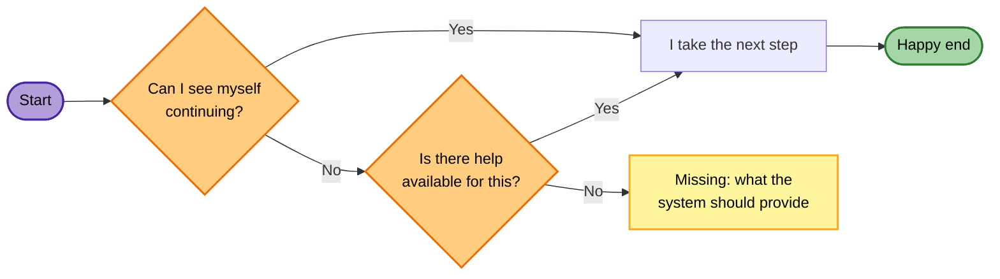
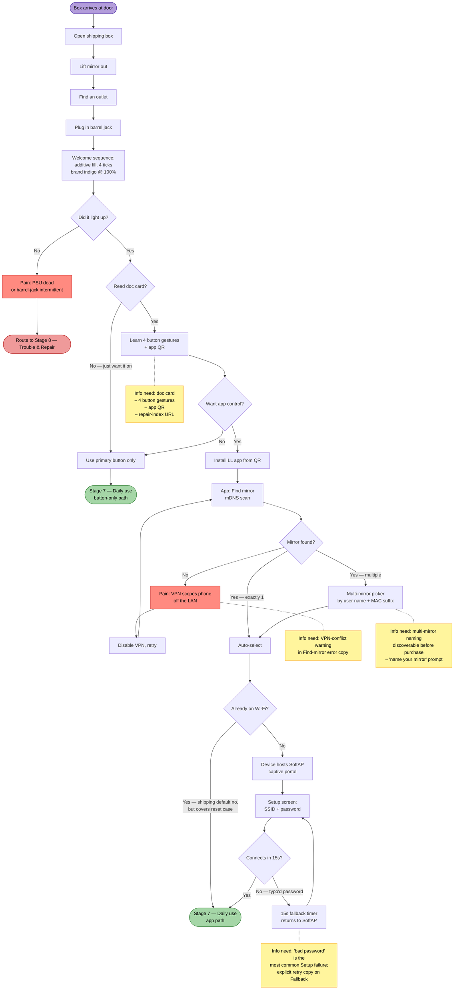

# Service Blueprint — Stage Flows

Companion to [docs/service-blueprint.md](service-blueprint.md). Each of the ten journey stages has an internal user flow — decision branches, pain points, information needs, recovery loops, and end-states. This document captures those flows as Mermaid diagrams that render inline in both Obsidian and GitHub. The flows are an editable, iterable source-of-truth; for portfolio-grade Figma renders, the structure here is what gets traced.

> **Strict grid-style renders:** the Mermaid blocks here render with curved or step edges in GitHub / Obsidian. For the locked grid-style (right-angle, port-pinned) version used in the [`.preview/`](../.preview/) HTML files, see [docs/user-flow-authoring.md](user-flow-authoring.md) — that's the Graphviz-based methodology + rendering recipe with reusable templates.

## Conventions

Every stage flow uses the same shape and color grammar so a reader can skim across stages without re-learning the legend:

| Shape + color | Meaning |
|---|---|
| Purple oval | Start state — the user enters the stage |
| Green oval | Happy end — the user continues the journey or reaches a successful outcome |
| Red oval | Unhappy end — user bounces; the system has no recovery move at this stage |
| White rectangle | User action or system process step |
| White diamond | Neutral decision — a preference or non-pain branch |
| Orange diamond | User-voice question — pain check OR recovery probe; phrased in first person |
| Yellow rectangle | Missing info / system-fail callout — what the system needs to provide |

**Layout convention.** Flow direction is left-to-right; the happy path runs along the top as a straight horizontal line. Diamond `Yes` answers continue right along the golden path; `No` answers drop down into recovery / bounce branches. Recovery `Yes` answers rejoin the golden path at the next gate.

**Edge routing convention (orthogonal / grid).** `Yes` edges connect from the right vertex of the source to the left vertex of the target — horizontal, going right. `No` edges connect from the bottom vertex of the source to the top vertex of the target — vertical, going down. Recovery `Yes` edges that rejoin the golden path route as an inverted-L: right out of the recovery diamond, up to the bottom of the next golden-path gate. This grid-style routing requires the ELK layout engine (`%%{init: {"layout": "elk"}}%%`) — Mermaid's default renderer uses bezier curves that don't respect strict port positions.

**User voice convention.** Every diamond and most action rectangles are phrased in first person (`I` / `me` / `my`). The flow models the user's thought process, not the system's external view of it. This makes the diagram predictive rather than descriptive — by naming the questions users ask themselves and the moments they look for help, the system can identify the content, assets, and signals it needs to pre-answer them.

**Pain vs unhappy-end.** Orange diamonds name a friction the user is evaluating; a `No` answer is the user starting to disengage. Red ovals are the actual exit outcomes — the user is gone. Friction (orange) ≠ exit (red).

**Two-layer pain evaluation: pain → recovery probe → missing-info or rejoin.** When a pain question gets `No`, the user doesn't immediately bounce — they look for help. The flow models this with a follow-up orange diamond ("Is there a tool to help me X?"). `Yes` on the recovery probe rejoins the golden path at the next gate (the user has been saved). `No` on the recovery probe terminates at a yellow rectangle naming what's missing — that's both an honest fail callout and a build-this backlog item.

**Recovery probes are optional.** Some pains have no recovery layer because the bounce is genuinely unfixable at this stage (wrong vibe, wrong time, wrong life moment). In those cases the pain question's `No` goes directly to a red oval. Don't manufacture recovery probes for unrecoverable pains — over-engineering the model dilutes its predictive value.

**On multiple entry points and modality.** A flow can have multiple entry points only if they're genuinely differentiated by user behavior or motivation — not just by channel modality. *Seeing a listing on Etsy* and *seeing a listing on Instagram* are the same encounter for flow purposes. Compress to the core that channels share.

---

## Stage 1 — Discover

The buyer encounters the product for the first time. The earlier drafts treated this as a single Grab-or-Bounce decision; this revision models the user's actual cognitive flow as a chain of internal yes/no questions. Each question is a moment-of-truth where they might exit. The system's job is to make every `Yes` easy to reach by pre-answering the question with the right asset, signal, or copy.

```mermaid
%%{init: {"layout": "elk", "elk": {"elk.algorithm": "layered", "elk.direction": "RIGHT", "elk.edgeRouting": "ORTHOGONAL", "elk.spacing.nodeNode": 60, "elk.layered.spacing.nodeNodeBetweenLayers": 90}}}%%
flowchart LR
    Encounter([User encounters a<br/>Layered Logic<br/>infinity mirror]) --> Q1{Does this fit<br/>my vibe?}
    Q1 -->|Yes| Q2{Can I imagine this<br/>in my space?}
    Q2 -->|Yes| Q3{Is this worth<br/>what they're asking?}
    Q3 -->|Yes| Q4{Can I trust<br/>this maker?}
    Q4 -->|Yes| Q5{Is now a good time<br/>for me to engage?}
    Q5 -->|Yes| Click[I click through<br/>or engage]
    Click --> Stage2([Stage 2 — Consider])

    Q1 -->|No| LostVibe([Bounce – not my vibe])

    Q2 -->|No| Q2r{Is there a tool to<br/>help me visualize it?}
    Q2r -->|Yes| Q3
    Q2r -->|No| Missing2[Missing: in-room photos<br/>with scale anchor<br/>– person or furniture]

    Q3 -->|No| Q3r{Is there a reason<br/>this is priced this way?}
    Q3r -->|Yes| Q4
    Q3r -->|No| Missing3[Missing: 'why this costs<br/>this' transparency copy<br/>+ repair / sustainability story]

    Q4 -->|No| Q4r{Can I find proof of<br/>others' experience?}
    Q4r -->|Yes| Q5
    Q4r -->|No| Missing4[Missing: reviews, creator<br/>placement, coffee-shop<br/>discovery, social proof]

    Q5 -->|No| LostTime([Bounce – not now])

    classDef start fill:#b39ddb,stroke:#4527a0,color:#000,stroke-width:2px
    classDef endHappy fill:#a5d6a7,stroke:#2e7d32,color:#000,stroke-width:2px
    classDef endBad fill:#ef9a9a,stroke:#b71c1c,color:#000,stroke-width:2px
    classDef painQ fill:#ffcc80,stroke:#ef6c00,color:#000,stroke-width:2px
    classDef info fill:#fff59d,stroke:#f9a825,color:#000,stroke-width:2px

    class Encounter start
    class Stage2 endHappy
    class LostVibe endBad
    class LostTime endBad
    class Q1 painQ
    class Q2 painQ
    class Q3 painQ
    class Q4 painQ
    class Q5 painQ
    class Q2r painQ
    class Q3r painQ
    class Q4r painQ
    class Missing2 info
    class Missing3 info
    class Missing4 info
```

### Methodology notes from this revision

- **Pain points are user-voice questions, not system descriptions.** Reframing forces the writer to inhabit the user's mind: instead of *"Pain: first-impression asset failed to land scale"* (system-view), the question is *"Can I imagine this in my space?"* (user-view). Same insight, dramatically different posture — and the user-view directly identifies what the system must build, since the question literally names what needs answering.
- **Question order follows natural cognition: vibe → visualize → value → trust → timing.** The aesthetic gut check fires fastest (sub-second on a thumbnail); only if it lands does the user start imagining the piece in their actual space; only if visualizable does value-math become relevant; only if the value works does trust become the gate; only after all four does timing matter.
- **Two-layer pain evaluation: pain → recovery probe → missing or rejoin.** When a user fails an initial gut check, they don't immediately bounce — they look around for help. The flow models this with a second orange diamond ("Is there a tool to help me X?"). `Yes` returns them to the golden path at the next gate; `No` terminates at a yellow "Missing: X" callout. Each yellow terminal is a concrete build-this item for the venture — the diagram doubles as a backlog.
- **Recovery probes are skipped for unfixable pains.** Q1 (`Does this fit my vibe?`) and Q5 (`Is now a good time?`) go straight to red bounces with no recovery layer. Aesthetic fit and life-timing aren't system-fixable at this stage; modeling a recovery probe for them would be dishonest theater.
- **Orange diamond reserved for friction (user evaluation); red oval reserved for exit (user gone).** The two-layer pattern means there can now be *two* orange diamonds in a row for a single pain — the pain itself and its recovery probe. Both are user-voice evaluations; the asymmetry is that the second one is about whether *the system has help available*, not whether *the product fits*.
- **The flow is now a build-this backlog.** Three yellow terminals correspond to three concrete system investments: (1) in-room scale-anchored photography, (2) pricing-rationale transparency copy, (3) social proof / creator placement / coffee-shop discovery. Each is a project. Each is a venture decision. The flow tells us what to fund, in priority order, by which bounces it would prevent.

---

## Stage 6 — Unbox & Set Up

> **Pending retrofit.** This flow predates the v4 conventions (pain-as-user-voice-diamond, orange/red split, no dotted commentary). It still uses red pain rectangles and dotted-edge info notes. It will be rewritten once the v4 grammar is fully validated against more stages; leaving in place here as a reference point for what changed.

The two-minute window where every prior decision (brand, packaging, button interface, firmware default state, provisioning UX) compounds into a first impression. Hardest version of this stage: the gift recipient who didn't choose the product and won't read a manual ([stakeholder map §3.3](stakeholder-map.md)). The flow has to make a *no-app, no-instructions* path work as a first-class outcome — installing the app is opt-in polish, not a gate on the product working ([LL-027 §5.1](firmware-architecture-scoping.md)).

### What this flow says

- **Two equally valid happy paths.** Button-only and app-controlled are both first-class. The flow doesn't bias toward the app — Read card + No app is the same end-state as Read card + Yes app. This is the "works without an app" property from the [cross-cutting system properties table](service-blueprint.md#cross-cutting-system-properties) made concrete.
- **Every fail-point has a recovery loop in the flow itself.** Bad password → 15s fallback → SoftAP retry; VPN → disable → retry; multiple mirrors → picker → continue. The only no-recovery branch is PSU DOA, which routes out to Stage 8.
- **Four information needs surfaced.** Two are physical (doc card content, naming prompt) and two are digital (in-app error copy for VPN and bad-password). These are the explicit triggers for downstream work: doc card design ([LL-044](../tasks.md#LL-044), blocked on [LL-051](../tasks.md#LL-051) packaging), name-your-mirror onboarding prompt (new, surfaced here), VPN warning copy ([LL-046](../tasks.md#LL-046) UX polish — already shipped), bad-password explicit copy on the fallback (new, surfaced here).
- **The gift-recipient case is the button-only path.** If you trace `Open box → Outlet → Plug → Welcome → Read card? No → Button-only → Daily use`, that's a working product without any app, account, or Wi-Fi credentials. This is the test of the "tech disappears" founding principle from [brand positioning §2](brand-positioning.md).

---

## Other stages — TBD

The same pattern applies to the remaining nine. Suggested flow scope per stage so it's clear what each one captures (not yet drafted — confirm Stage 6's style first, then I'll generate the rest):

| Stage | Flow centers on |
|---|---|
| 2 — Consider | Standard-vs-custom fork; price-objection branch; lead-time-disclosure branch |
| 2b — Consult (custom) | The full 10-step custom-order flow already enumerated in [service-blueprint §Custom Order Deep Dive](service-blueprint.md#custom-order-deep-dive) — converts that prose directly to flow |
| 3 — Purchase | Checkout path (Etsy vs Shopify vs custom-invoice); post-purchase email cadence; build-queue entry decision |
| 4 — Manufacture & QC | Internal-only flow: traveler card through 3 parallel lanes → final assembly → QC fork (pass / minor rework / fail-and-replace) |
| 5 — Fulfill | Pack-and-ship station flow; insurance-threshold decision; gift-address sanity check |
| 7 — Daily use | Day-in-the-life branches: button only / app for fine control / guest using button without app / OTA-arrives loop |
| 8 — Trouble & repair | Self-recover vs RMA fork; per-failure-mode branch (LED dead pixel, controller stuck, Wi-Fi lost, etc.); film-the-repair backstage loop |
| 9 — Returns | Return decision → resellable-as-is / reworkable-with-new-plane / scrap-plane-only; refund processing |
| 10 — End-of-life | User decision: throw away / pass on / disassemble; LL backstage: OTA-support window, open-source-on-exit commitment |

Some of these (Stage 4 manufacture, Stage 5 fulfill) are mostly internal/operational and may be better served by a swimlane diagram than a decision flow — that's a style call worth making once we have one of the customer-facing flows locked.

---

## Related

- [Service Blueprint](service-blueprint.md) — the parent doc this companion deepens
- [Stakeholder Map](stakeholder-map.md) — the cast feeding each stage flow
- [Button Interface](button-interface.md) — Stage 6/7 physical UI grammar
- [Firmware Architecture Scoping](firmware-architecture-scoping.md) — the "works without app" principle made concrete here
- [User Interview Outline](user-interview-outline.md) — the open research questions surfaced by each flow can be folded back into the interview agenda
