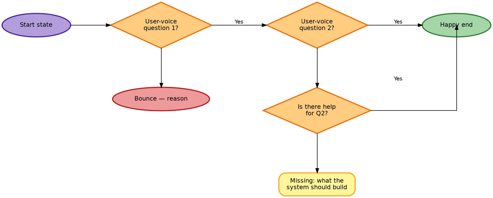

# User Flow Authoring — Methodology & Rendering Recipe

How Layered Logic authors user-flow diagrams for HCDE artifacts (service blueprints, journey maps, recovery flows). Two parts:

1. **Methodology** — what the flow *says* (node grammar, voice conventions, recovery patterns). Full conventions in [service-blueprint-flows.md § Conventions](service-blueprint-flows.md#conventions); summary below.
2. **Rendering recipe** — how the flow gets drawn (Graphviz + viz-js WASM). This part is non-obvious; it was iterated through several wrong turns before landing.

---

## Methodology summary

Six rules that produce predictive, user-centric flows instead of descriptive system diagrams:

1. **User voice.** Every diamond and most action rectangles use first person: `I` / `me` / `my`. The flow models the user's thought process, not the system's view. Diamonds become introspective questions ("Can I imagine this in my space?") rather than system observations ("scale not conveyed").
2. **Pain → recovery probe → missing-or-rejoin.** When a user fails an initial gut check, they don't immediately bounce — they look for help. Encode this as a follow-up user-voice diamond ("Is there a tool to help me X?"). `Yes` rejoins the golden path at the next gate; `No` terminates at a `Missing:` callout naming what the system needs to build. Recovery is *optional* — some pains (wrong vibe, wrong time) genuinely lack a system-level fix.
3. **Orange diamond = friction; red oval = exit.** Friction (the user is still evaluating) is visually distinct from exit (the user is gone). A flow can have many orange diamonds but only a few red ovals.
4. **Yellow rectangle = build-this backlog.** Every `Missing:` terminal is a concrete asset / copy / signal investment ranked by which bounces it would prevent. The flow doubles as a backlog.
5. **Natural cognitive order.** Always do an explicit reorder pass on the question sequence. For consumer-purchase flows the typical cascade is **vibe → visualize → value → trust → timing**. The aesthetic gut check fires sub-second; nobody tries to imagine a piece in their space before deciding they like the look.
6. **Don't fork on modality.** Multiple entry points must be genuinely differentiated by user behavior or motivation — not channel modality. *Etsy listing* and *Instagram listing* are the same encounter for flow purposes. Compress to the core that channels share.

---

## Rendering recipe — what works, what doesn't

### TL;DR

**Use Graphviz via `@viz-js/viz` (WASM). Not Mermaid.** Author in DOT with `rankdir=LR`, `splines=ortho`, explicit port specifiers (`:e`, `:w`, `:s`, `:n`), and per-column `rank=same` groups. Render to SVG in a self-contained HTML preview file at `.preview/<flow-name>.html`.

### Why not Mermaid

Tried, ruled out — captured here so this isn't re-litigated:

- **Default bezier curves are too curvy.** No way to get clean right-angle bends without changing the curve setting.
- **`flowchart.curve = "step"` gives right-angle bends** but doesn't control *which vertex* of a node an edge connects to. Auto-layout picks connection points heuristically. Yes-edges don't reliably exit the right vertex; No-edges don't reliably exit the bottom vertex.
- **Mermaid + ELK plugin** can do orthogonal routing in principle, but the plugin requires registering a layout loader and the CDN bundle fails to load reliably in preview environments. When it fails it can leave the page showing raw mermaid source — no graceful fallback.
- **No port control at all.** Even if ELK works, Mermaid's flowchart syntax doesn't expose port specifiers on edges.

Bottom line: Mermaid is fine for quick decision trees that read top-to-bottom with curved edges. For strict grid-style layouts with user-voice flow conventions, it's the wrong tool.

### Why Graphviz works

- **`splines=ortho`** routes every edge as right-angle line segments. No bezier curves anywhere.
- **Explicit port specifiers** pin edges to specific vertices: `Q1:e -> Q2:w` exits the east vertex of Q1 and enters the west vertex of Q2. Strict port-pinned routing is the whole point.
- **`{ rank=same; A; B; C }` groups** force nodes onto the same rank. Combined with `rankdir=LR`, this gives column-based vertical stacking *(see gotcha below)*.
- **`@viz-js/viz`** ships Graphviz compiled to WebAssembly via jsdelivr. Stable, well-maintained, single-file standalone bundle, no plugin-registration dance.

### The big `rank=same` gotcha

In Graphviz with `rankdir=LR`, **`rank=same` means same *column*** (a vertical strip), not same row. A common first-attempt mistake is to write:

```dot
{ rank=same; HappyA; HappyB; HappyC; HappyD; }   // WRONG
```

Expecting the happy-path nodes to land on the same horizontal row. They don't — they get forced into the same *column* and stack vertically, making the flow render top-down primary instead of left-to-right primary.

**The right pattern:** don't use rank=same on the happy path at all. Let Graphviz's natural `rankdir=LR` layout place each node in its own column (one per rank along the x-axis). Then use per-column rank groups to stack each pain diamond's dependents (bounce / recovery / missing-info) beneath it:

```dot
{ rank=same; Q1; LostVibe; }              // Q1's column
{ rank=same; Q2; Q2r; Missing2; }         // Q2's column
{ rank=same; Q3; Q3r; Missing3; }         // Q3's column
{ rank=same; Q4; Q4r; Missing4; }         // Q4's column
{ rank=same; Q5; LostTime; }              // Q5's column
```

Add `weight=10` to every happy-path edge to bias Graphviz toward keeping the top row tight:

```dot
Q1:e -> Q2:w [label="  Yes", weight=10];
```

That's the recipe that produced the working Stage 1 preview.

### Port specifier conventions

Locked across all Layered Logic user-flow diagrams:

| Edge type | Port specifier | Geometry |
|---|---|---|
| `Yes` (golden-path forward) | `source:e -> target:w` | Horizontal, right-to-left along the top row |
| `No` (drops to bounce / recovery / missing) | `source:s -> target:n` | Vertical, top-to-bottom within a column |
| Recovery `Yes` rejoin | `source:e -> target:w` | Inverted-L: out the right, up, into the left of the next gate |

The recovery rejoin case is the only one where `:e -> :w` doesn't produce a purely horizontal edge — because the target is one column right and one row *up*. Graphviz with `splines=ortho` routes this as a clean inverted-L.

---

## Reusable DOT template

Copy this for new stage flows. Replace the node definitions and edges; keep the structural skeleton.



---

## Reusable HTML preview template

Drop this at `.preview/<stage>.html`, paste the DOT into the `dotSource` template literal, and open in any modern browser. No build step. No npm install. Just opens.

```html
<!DOCTYPE html>
<html lang="en">
<head>
<meta charset="UTF-8" />
<title>Stage N — TITLE</title>
<style>
  body { margin: 0; padding: 32px; background: #f7f5f0; font-family: system-ui, sans-serif; }
  .card { max-width: 1800px; margin: 0 auto; padding: 24px; background: #fff; border-radius: 12px; }
  #chart { text-align: center; min-height: 200px; }
  #chart svg { max-width: 100%; height: auto; }
  .status { max-width: 1800px; margin: 8px auto 0; padding: 8px 14px; background: #fff; border-radius: 8px; font: 12px ui-monospace, monospace; color: #6e6e73; }
  .err { color: #b71c1c; background: #ffebee; }
</style>
</head>
<body>
<header style="max-width:1800px;margin:0 auto 24px;">
  <h1 style="font-weight:300;font-style:italic;margin:0 0 6px;">Stage N — TITLE</h1>
</header>
<div class="card"><div id="chart">Loading Graphviz…</div></div>
<div class="status" id="status">Initializing renderer…</div>

<script src="https://cdn.jsdelivr.net/npm/@viz-js/viz@3/lib/viz-standalone.js"></script>
<script>
  const dotSource = `digraph { /* paste DOT here */ }`;
  const chart = document.getElementById("chart");
  const status = document.getElementById("status");

  function fail(msg, err) {
    status.className = "status err";
    status.textContent = msg + (err ? ": " + (err.message || err) : "");
    chart.textContent = "(rendering failed — see status line)";
    if (err) console.error(err);
  }

  if (typeof Viz === "undefined") {
    fail("Viz library did not load from CDN. Check network / blockers");
  } else {
    Viz.instance().then(viz => {
      try {
        const svg = viz.renderSVGElement(dotSource);
        chart.innerHTML = "";
        chart.appendChild(svg);
        status.textContent = "Renderer: Graphviz · splines=ortho · port-pinned edges";
      } catch (e) { fail("Graphviz render error", e); }
    }).catch(e => fail("Graphviz instance() failed", e));
  }
</script>
</body>
</html>
```

---

## How we got here (debugging log)

For traceability when iterating later:

1. **Mermaid default (bezier).** Curvy, no port control. Rejected.
2. **Mermaid `curve: "step"`.** Right-angle bends but auto-layout port-picking. Edges didn't consistently exit right vertex on Yes / bottom vertex on No.
3. **Mermaid + ELK plugin via `mermaid.registerLayoutLoaders()`.** Plugin failed to load from CDN; broke the entire render and left the page showing raw source. Tried `await import()` with try/catch fallback — still flaky.
4. **Switched to Graphviz via `@viz-js/viz`.** Reliable, stable, no plugin registration. First DOT had the wrong `rank=same` constraints (one big group for the happy path) → top-down primary instead of left-right primary.
5. **Per-column rank groups + weight=10 on happy-path edges.** Locked. Produces correct grid layout with port-pinned edges.

The `rank=same`-means-same-column gotcha is the highest-value learning here — easy to get wrong, hard to debug from the output (the output looks "almost right" so you don't immediately suspect the rank groups).

---

## Related

- [Service Blueprint Flows](service-blueprint-flows.md) — the methodology + Stage 1 example
- [Service Blueprint](service-blueprint.md) — parent doc the flows companion deepens
- [User Interview Outline](user-interview-outline.md) — where flow insights feed back into research

---

<p align="center"><em>Layered Logic LLC — Spring 2026</em></p>
