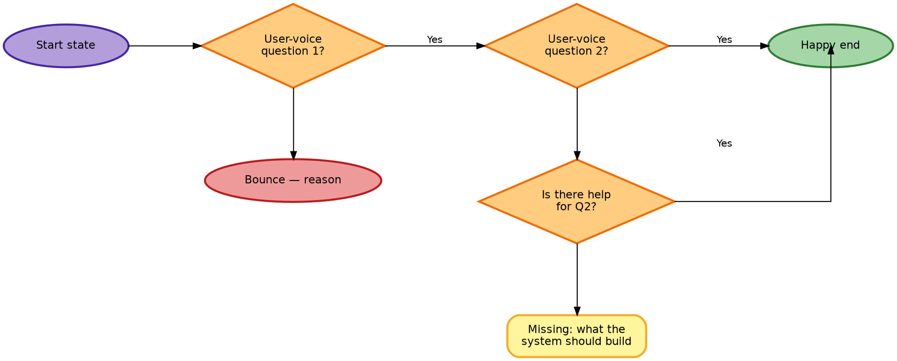

# User Flow Authoring — Methodology & Rendering Recipe

How Layered Logic authors user-flow diagrams for HCDE artifacts (service blueprints, journey maps, recovery flows). Two parts:

1. **Methodology** — what the flow *says* (node grammar, voice conventions, recovery patterns). Full conventions in [service-blueprint-flows.md § Conventions](service-blueprint-flows.md#conventions); summary below.
2. **Rendering recipe** — how the flow gets drawn (Graphviz + viz-js WASM). This part is non-obvious; it was iterated through several wrong turns before landing.

---

## Methodology summary

Six rules that produce predictive, user-centric flows instead of descriptive system diagrams:

1. **User voice.** Every diamond and most action rectangles use first person: `I` / `me` / `my`. The flow models the user's thought process, not the system's view. Diamonds become introspective questions ("Can I imagine this in my space?") rather than system observations ("scale not conveyed").
2. **Pain → recovery probe → missing-or-rejoin.** When a user fails an initial gut check, they don't immediately bounce — they look for help. Encode this as a follow-up user-voice diamond ("Is there a tool to help me X?"). `Yes` rejoins the golden path at the next gate; `No` terminates at a `Missing:` callout naming what the system needs to build. Recovery is *optional* — some pains (wrong vibe, wrong time) genuinely lack a system-level fix.
3. **Orange diamond = friction; red oval = exit.** Friction (the user is still evaluating) is visually distinct from exit (the user is gone). A flow can have many orange diamonds but only a few red ovals.
4. **Yellow rectangle = build-this backlog.** Every `Missing:` terminal is a concrete asset / copy / signal investment ranked by which bounces it would prevent. The flow doubles as a backlog.
5. **Natural cognitive order.** Always do an explicit reorder pass on the question sequence. For consumer-purchase flows the typical cascade is **vibe → visualize → value → trust → timing**. The aesthetic gut check fires sub-second; nobody tries to imagine a piece in their space before deciding they like the look.
6. **Don't fork on modality.** Multiple entry points must be genuinely differentiated by user behavior or motivation — not channel modality. *Etsy listing* and *Instagram listing* are the same encounter for flow purposes. Compress to the core that channels share.

---

## Rendering recipe — what works, what doesn't

### TL;DR

**Hybrid Graphviz + JS.** Graphviz (via `@viz-js/viz` WASM) lays out the nodes; a custom JS layer in the HTML preview draws every edge from scratch using pixel-perfect port coordinates and 5-segment Z routing through the clear band between rows. All edges in the DOT are `style=invis` — Graphviz uses them for rank/column assignment but doesn't render them. The JS layer reads each node's `getBBox()` and emits ortho paths that pin to the exact vertex.

This bypasses `splines=ortho`'s built-in port-shifting heuristic, which we proved (empirically, after several rounds of testing) cannot be overridden via any DOT attribute when the route turns upward from a wide diamond.

Output is a self-contained HTML file at `.preview/<flow-name>.html`. No build step. Includes zoom + pan controls so flows with many nodes stay readable.

### Why not Mermaid

Tried, ruled out — captured here so this isn't re-litigated:

- **Default bezier curves are too curvy.** No way to get clean right-angle bends without changing the curve setting.
- **`flowchart.curve = "step"` gives right-angle bends** but doesn't control *which vertex* of a node an edge connects to. Auto-layout picks connection points heuristically. Yes-edges don't reliably exit the right vertex; No-edges don't reliably exit the bottom vertex.
- **Mermaid + ELK plugin** can do orthogonal routing in principle, but the plugin requires registering a layout loader and the CDN bundle fails to load reliably in preview environments. When it fails it can leave the page showing raw mermaid source — no graceful fallback.
- **No port control at all.** Even if ELK works, Mermaid's flowchart syntax doesn't expose port specifiers on edges.

Bottom line: Mermaid is fine for quick decision trees that read top-to-bottom with curved edges. For strict grid-style layouts with user-voice flow conventions, it's the wrong tool.

### Why Graphviz for layout, JS for edges

- **Graphviz layout is right.** `rankdir=LR` + per-column `rank=same` groups place gates left-to-right with their recoveries/missings stacked beneath. Best-in-class hierarchical layout.
- **Graphviz edge routing is wrong for our methodology.** Two specific failures, both built into the engine and unconfigurable:
  1. **Port shift on `splines=ortho`.** For any edge that turns (e.g. recovery rejoin going east-then-up), Graphviz silently shifts the source port from the requested vertex to a nearby face midpoint, to "make the turn easier." Result: visible ~17-pixel offset from the diamond's actual east vertex. Cannot be overridden by `tailclip`, `headport`, HTML labels with explicit `PORT=` attributes, junction nodes, or shape changes. Verified after extensive testing.
  2. **Label drop on short ortho edges.** Labels on short vertical south-going edges silently don't render. `forcelabels=true` only applies to `xlabel`, not `label`.
- **The JS layer fixes both.** It reads each node's `getBBox()`, computes port coordinates exactly (no router heuristic), draws every edge as a constructed SVG path with explicit corners, places labels at the geometric midpoint of the appropriate leg, and emits arrowhead polygons at the exact endpoint.
- **`@viz-js/viz`** ships Graphviz compiled to WebAssembly via jsdelivr. Stable, well-maintained, single-file standalone bundle, no plugin-registration dance.

### Edge routing patterns the JS layer emits

| Edge type | Source port | Target port | Path |
|---|---|---|---|
| Happy path (same row) | `e` | `w` | Straight horizontal |
| `No` drop (same column) | `s` | `n` | Straight vertical |
| Recovery `Yes` rejoin (up) | `e` | `s` | 5-segment Z: east stub → up to clear band → east → up to target south (shifted 5px west) |
| Sub-flow entry (down) | `e` | `n` | 5-segment Z: east stub → down to clear band → east → down to target north (shifted 5px west) |
| Exit gate → happy oval | `e` (or `s`) | `w` (or `n`) | Straight horizontal (or vertical) |

The "clear band" Y coordinate is computed from the source's and target's bounding boxes — it's the midpoint between source's facing edge and target's facing edge. This always lands in the row gap, so the horizontal leg doesn't cross recovery-row content in any column it spans.

The 5px shift on the vertical leg visually separates a rejoin entering a gate's south from a "No" line dropping out of the same south port.

### The big `rank=same` gotcha

In Graphviz with `rankdir=LR`, **`rank=same` means same *column*** (a vertical strip), not same row. A common first-attempt mistake is to write:

```dot
{ rank=same; HappyA; HappyB; HappyC; HappyD; }   // WRONG
```

Expecting the happy-path nodes to land on the same horizontal row. They don't — they get forced into the same *column* and stack vertically, making the flow render top-down primary instead of left-to-right primary.

**The right pattern:** don't use rank=same on the happy path at all. Let Graphviz's natural `rankdir=LR` layout place each node in its own column (one per rank along the x-axis). Then use per-column rank groups to stack each pain diamond's dependents (bounce / recovery / missing-info) beneath it:

```dot
{ rank=same; Q1; LostVibe; }              // Q1's column
{ rank=same; Q2; Q2r; Missing2; }         // Q2's column
{ rank=same; Q3; Q3r; Missing3; }         // Q3's column
{ rank=same; Q4; Q4r; Missing4; }         // Q4's column
{ rank=same; Q5; LostTime; }              // Q5's column
```

Add `weight=10` to every happy-path edge to bias Graphviz toward keeping the top row tight:

```dot
Q1:e -> Q2:w [label="  Yes", weight=10];
```

That's the recipe that produced the working Stage 1 preview.

### Port specifier conventions

Edges live in a separate JS data structure (not in the DOT). Each entry: `{ from, fromPort, to, toPort, label? }`. Ports are compass shorthand (`n`/`s`/`e`/`w`) — the JS router picks the route shape from the port pair.

| Edge type | Source port | Target port | Visual outcome |
|---|---|---|---|
| Happy path forward | `e` | `w` | Straight horizontal at gate row Y |
| `No` drops to bounce / recovery / missing | `s` | `n` | Straight vertical in same column |
| Recovery `Yes` rejoin to next gate | `e` | `s` | 5-seg Z up through clear band, lands 5px west of target south |
| Sub-flow entry from recovery | `e` | `n` | 5-seg Z down through clear band, lands 5px west of target north |
| Sub-flow rejoin back to parent gate | `s` | `s` | U-shape: down to clear-Y-below, west across, up to target south; **dashed green** (mark the edge `style: 'rejoin'`) |
| Exit gate → happy oval (south) | `s` | `n` | Straight vertical (often the exit oval is pushed further south via nodeTweaks) |
| Exit gate → happy oval (east) | `e` | `w` | Straight horizontal |

The recovery rejoin and sub-flow entry both shift 5px away from the target's center (toward the source) so they don't share a column with a same-direction `No` line.

The **sub-flow rejoin** is a loop-back: source is south-and-east of target. The router detects this (`src.x > tgt.x AND src.y > tgt.y`, both ports `s`) and emits a U-shape through `bounds.clearYBelow` — a Y value 30 px below the bottommost node, computed from all node bboxes at render time. The SVG viewBox is auto-extended so the U-tail doesn't get clipped. Set `style: 'rejoin'` on the edge entry to get the dashed green styling that visually distinguishes it from forward edges.

### Layout tweaks (`nodeTweaks`)

For nodes that Graphviz packs too close to the rejoin paths, define a `nodeTweaks` entry in the HTML template:

```js
const nodeTweaks = {
  EndSave:  { dy: 100 },   // push south so its column doesn't collide with rejoin's vertical leg
  EndShare: { dy: 100 },

  // Center a sub-loop horizontally under the parent gates it spans.
  // Shift all sub-loop nodes by the same dx so the loop sits visually
  // under the entry-gate ↔ rejoin-gate range, not stretched off to
  // one side. Keep the magnitude small enough that the entry edge
  // (e.g. Q4r:e → S1:n) still resolves cleanly — S1 must stay east
  // of Q4r's east face.
  S1:        { dx: -150 },
  S1r:       { dx: -150 },
  MissingS1: { dx: -150 },
  S2:        { dx: -150 },
  MissingS2: { dx: -150 },
  S3:        { dx: -150 },
  MissingS3: { dx: -150 },
};
```

The tweak shifts the node visually via `transform="translate(dx dy)"` AND updates its bbox so subsequent edge routing uses the new position. Apply this to happy-end ovals (which sit at recovery-row Y by default), bounces that share a column with a rejoin target, sub-loops you want centered under their parent gates, or anything else Graphviz placed in a path's way.

---

## Reusable DOT template

Copy this for new stage flows. Replace the node definitions and edges; keep the structural skeleton.



---

## Reusable HTML preview template

The canonical template lives at [`.preview/visualizer.html`](../.preview/visualizer.html) (the first flow built with this methodology — Stages 2 / 2b / 3 of the service blueprint). When authoring a new flow, copy that file, replace the three sections marked below, and open in any modern browser. No build step.

**Three sections to replace** for a new flow:

1. **`dotSource`** — the DOT block. Same structure as the [Reusable DOT template](#reusable-dot-template) above. All edges are `style=invis` because the JS layer renders them.
2. **`edges`** — the JS array of `{from, fromPort, to, toPort, label?}` objects. The JS router builds the visible SVG from this.
3. **`nodeTweaks`** — optional `{ dx, dy }` offsets for nodes that Graphviz packed too close to a routing path.

The locked template includes:
- Graphviz layout via `@viz-js/viz@3` (WASM, single CDN script tag)
- Custom JS edge renderer (`routeEdge`, `portPoint`, `arrowheadAt`, `labelAt`) with the routing patterns documented above
- Layout-tweak pass (`applyTweaks`) that runs between Graphviz layout and edge rendering
- Zoom + pan controls (mouse drag, scroll wheel, ± buttons in a zoom bar)
- Status line showing edges drawn / skipped

If you need to lift the template into a different file (cross-repo, etc.), copy `.preview/visualizer.html` verbatim and edit the three sections.

---

## How we got here (debugging log)

For traceability when iterating later:

1. **Mermaid default (bezier).** Curvy, no port control. Rejected.
2. **Mermaid `curve: "step"`.** Right-angle bends but auto-layout port-picking. Edges didn't consistently exit right vertex on Yes / bottom vertex on No.
3. **Mermaid + ELK plugin via `mermaid.registerLayoutLoaders()`.** Plugin failed to load from CDN; broke the entire render and left the page showing raw source. Tried `await import()` with try/catch fallback — still flaky.
4. **Switched to Graphviz via `@viz-js/viz`.** Reliable, stable, no plugin registration. First DOT had the wrong `rank=same` constraints (one big group for the happy path) → top-down primary instead of left-right primary.
5. **Per-column rank groups + weight=10 on happy-path edges.** Locked. Produces correct grid layout with port-pinned edges.
6. **Discovered `splines=ortho` port-shift on first multi-row flow.** Recovery rejoin tails were starting ~17 pixels above the diamond's actual east vertex. The shift looked like a bug at first; turns out it's the router intentionally biasing the exit toward the NE face for upward turns.
7. **Tried every documented override.** None worked: `tailclip=false` / `headclip=false`, `headport=s`, switching diamonds to HTML labels with `PORT=` attributes (whether using compass-aliased names like `e` or distinct names like `right`), invisible junction nodes between source and target, HTML labels inside `shape=diamond` (made the offset 5x worse because ports anchored to the inner label box, not the diamond outline). The shift is a router heuristic, not an attribute.
8. **Switched to hybrid: Graphviz for layout, JS for edges.** All edges `style=invis` in the DOT; a JS layer reads `getBBox()` per node and emits SVG paths with explicit corners. Pixel-perfect port attachment.
9. **5-segment Z routing for inverted-L paths.** First version of the JS layer used a 3-segment L (east → up → into target). Worked for vertex pinning but the horizontal leg sat at recovery-row Y, crossing bounces and adjacent recovery diamonds in the columns it spanned. Fix: route the horizontal leg through a "clear band" Y between source's row and target's row, computed from bbox midpoints.
10. **`nodeTweaks` for post-layout offsets.** Even with clear-band routing, some nodes Graphviz packed at recovery-row level (happy-end ovals) collided visually with rejoin verticals. Added a tweak pass that shifts named nodes by `{dx, dy}` after Graphviz layout and updates their bbox so subsequent edge routing uses the new position.
11. **5px vertical-leg shift on rejoins.** With the Z routing in place, the rejoin's final vertical segment still landed dead-center on the target's south port, sharing x with the `No` line dropping out the same port. Added a small offset so rejoin lands 5px west of center, visually separating from the No line.
12. **Zoom + pan in the preview.** Flows past ~6 gates render too small at fit-to-screen. Added a zoom bar (− / 100% / +), mouse-drag pan, and scroll-wheel zoom anchored to cursor.

The biggest learning: **Graphviz's edge router is a separate concern from its layout.** Trying to make ortho routing match port specifications is fighting the engine. Owning the edge rendering ourselves was the unlock.

---

## Related

- [Service Blueprint Flows](service-blueprint-flows.md) — the methodology + Stage 1 example
- [Service Blueprint](service-blueprint.md) — parent doc the flows companion deepens
- [User Interview Outline](user-interview-outline.md) — where flow insights feed back into research

---

<p align="center"><em>Layered Logic LLC — Spring 2026</em></p>
