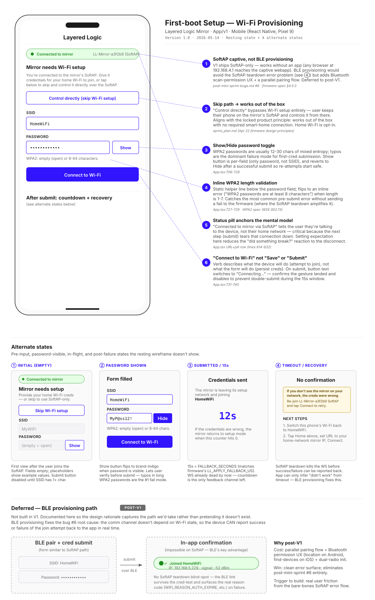

# First-boot Setup — Wi-Fi Provisioning

> **Chapter 3 of the LL-047 design-rationale set.** First-time-user provisioning is the most consequential surface in the product — it's the only screen many users see *before* the mirror starts being useful, and it tears down its own communication channel as part of normal operation. That last fact drives most of the decisions on this page.

**TL;DR:** SoftAP captive provisioning is the V1 path. User joins `LL-Mirror-XXXXXX`, opens the app, app sees the device on `192.168.4.1` and reports "Mirror needs Wi-Fi setup." User has two choices: provide home Wi-Fi creds, or skip and use the mirror entirely over its own SoftAP (the works-out-of-the-box principle). Submit tears down the SoftAP — by the time the device knows whether the creds worked, the WS link is dead and the device can't tell the app what happened. The screen handles this by setting expectation up-front (status pill), validating client-side (WPA2 length), and surfacing an honest "we can't tell — here's how to verify" recovery flow rather than faking a success signal.

## Wireframe

## Where this lives in the user journey

This is the **only** screen between "I just plugged in a new mirror" and "I can control it from my home network." Stage 6 (Unbox & Set Up) in the [service blueprint](../service-blueprint.md), specifically the *"connect it to my Wi-Fi"* branch — but with the *"skip Wi-Fi setup"* option this screen actually spans two Stage 6 outcomes: home-network operation vs. SoftAP-only operation.

Adjacent surfaces:
- **Stage 6 prequel — physical unboxing**: user joins `LL-Mirror-XXXXXX` from their phone's Wi-Fi settings, opens the app. The app's URL field defaults to `http://192.168.4.1/` (the SoftAP IP). When connection succeeds, this screen renders.
- **[Home — Controls](home-control.md) (chapter 2)** — where the user lands after a successful provisioning. If the user skipped, they land here while still connected to the SoftAP; if they provided creds and rejoined home Wi-Fi, the app reconnects to the mirror at its DHCP-assigned IP.
- **[Settings — Wi-Fi](settings-wifi.md) (chapter 1)** — the multi-network surface this screen is the prequel to; once on home Wi-Fi, adding additional networks is a Settings-side flow.

## Decisions

### ① SoftAP captive provisioning, not BLE

Source: [post-mini-sprint-bugs.md #6](../post-mini-sprint-bugs.md) · [firmware-spec.md §4.5.3](../firmware-spec.md)

The fundamental architectural choice for first-time setup. V1 ships SoftAP-only because:

1. **Works without an app.** The captive webapp at `192.168.4.1/` is reachable from any phone's browser. Users who don't want to install the LL app aren't locked out of provisioning.
2. **Single radio stack.** ESP32-C3 has both Wi-Fi and BLE, but using BLE for provisioning would mean a parallel pairing flow plus the BLE permission UX (Bluetooth scan / location permissions on Android, "find devices" on iOS).
3. **Familiar mental model.** Every smart-home device the user has set up before — TPLink, Govee, Hue Bridge — works this way.

The cost is bug #6: the SoftAP teardown during cred-test kills the WS connection before the device can report success/failure. BLE provisioning sidesteps this entirely because the BLE link doesn't depend on the Wi-Fi state — Espressif's `wifi_prov_mgr` BLE scheme can notify the client with `WIFI_PROV_CRED_FAIL` events carrying the underlying `wifi_prov_sta_fail_reason_t`. **Deferred to post-V1.** When BLE provisioning lands, it becomes the path for app users; SoftAP stays for browser-only users.

### ② Skip path — works out of the box

Source: [sprint_plan.md (Apr 22 firmware design principles)](../../sprint_plan.md)

The "Control directly (skip Wi-Fi setup)" button is the visible expression of a locked product principle: *the mirror works out of the box with no required smart-home connection.* Tapping this button keeps the phone on the SoftAP, dismisses the cred form, and routes the user straight to [Home — Controls](home-control.md). The mirror never leaves SoftAP mode unless explicitly told to.

The full set of consequences for the skip path:
- User controls the mirror over SoftAP for as long as they want (the mirror's SoftAP doesn't time out).
- Other devices on the user's home network can't reach the mirror until the user joins home Wi-Fi via Settings later.
- OTA isn't possible from the SoftAP path (no upstream internet) — flagged in the rationale doc, not in the UI.
- The user retains the option to provision later from Settings.

This is the deliberate alternative to the smart-home-mandatory pattern competitors use. Per [feedback_rf_minimal_unless_asked](../../.claude/projects/C--Users-bowhi-Desktop-Independent-Study/memory/feedback_rf_minimal_unless_asked.md), home Wi-Fi is opt-in.

### ③ Show/Hide password toggle

Source: [App.tsx:706-726](../../App/v1/App.tsx)

WPA2 passwords are usually 12-30 characters of mixed entropy — typos are the dominant failure mode for first-cred submission, and the SoftAP teardown turns typos into recovery loops. Show/Hide on the password field lets users verify before submit. Two specific details:

- **Per-field, not page-level.** Only password has Show/Hide; SSID is plain-text. Adding the toggle to SSID would imply privacy where there is none.
- **Resets to Hide after submit.** If the cred was wrong and the user reopens the page, the password starts hidden again. Re-attempts start safe rather than with the password visible on the screen.

### ④ Inline WPA2 length validation

Source: [App.tsx:727-729](../../App/v1/App.tsx) · WPA2 spec (IEEE 802.11i)

A static helper line lives below the password field (*"WPA2: empty (open) or 8-64 characters"*); it flips to an inline error in red (*"WPA2 passwords are at least 8 characters"*) when the field has 1-7 characters. This catches the most common pre-submit error without ever sending a guaranteed-failure to the firmware.

The cost of *not* validating here: the user submits a 5-char password, mirror tries it, mirror times out after 15s, falls back to SoftAP, user has to rejoin and start over. The cost of validating: 30 lines of React. The bug doc explicitly notes the SoftAP teardown amplifies every failure here, so any client-side preventable error is worth catching.

Open is allowed (empty password) for the rare hotel-network case — kept rather than blocking submit with an empty field.

### ⑤ Status pill anchors the mental model

Source: App.tsx URL+pill row (lines 614-632)

The green *"Connected to mirror via SoftAP"* pill at the top of the screen does load-bearing work for the user's mental model. The next button press (submit) tears that connection down. If the user doesn't know they're talking to *the mirror's network* and not *their home network*, the disconnect reads as "the app broke." Setting expectation up-front turns the disconnect into "yes, that's what was supposed to happen."

The pill is a real wire signal (the app's WS connection state), not a placeholder — it goes green only when the device responds to a ping, so the user can trust it as a readiness indicator.

### ⑥ "Connect to Wi-Fi" — verb-of-the-device, not verb-of-the-form

Source: [App.tsx:731-740](../../App/v1/App.tsx)

Button label is "Connect to Wi-Fi" — describing what the *device* is going to do — not "Save" or "Submit" — describing what the *form* is going to do. The verb framing matters because the operation has a long-running asynchronous side effect (joining a network) and the user needs to model what they're triggering, not what they're filling out.

On submit, the label switches to "Connecting…" — confirms the gesture landed and disables to prevent double-submit during the 15-second window. The "Connecting…" state outlives the WS connection (which dies as soon as the device leaves SoftAP); the app reads it from local in-flight state, not from a server ack.

## Alternate states

| State | Trigger | Design response |
|---|---|---|
| **① Initial (empty)** | First arrival on this screen | Helper text + Skip button visible; SSID/Password fields empty with placeholders. Submit disabled until SSID has 1+ char. |
| **② Password shown** | User taps "Show" | Password field renders in plain text; Show button flips to brand-indigo "Hide". On submit success, reverts to Hide for next time. |
| **③ Submitted / 15s** | User taps "Connect to Wi-Fi" | "Credentials sent" screen with brand-indigo countdown number (15 → 0). Copy explains the fallback. WS already dead by now — countdown is the only feedback channel. |
| **④ Timeout / Recovery** | Countdown reaches 0 with no broadcast confirmation | Honest "No confirmation" header; yellow warning box with recovery steps ("re-join SoftAP, try again"); explicit Next Steps if creds actually worked (switch phone Wi-Fi back to home, find mirror on home network). |

## Considered & rejected

**BLE provisioning as the V1 default.** Rejected for V1 — see callout ①. The architectural cost (parallel pairing flow + BLE permission UX) outweighed the bug #6 fix for V1 scope. Tracked as the right post-V1 move. The wireframe's **Deferred — BLE provisioning** section at the bottom is a placeholder mockup of the in-app success-confirmation flow BLE would enable; the SoftAP path can't ship this because the teardown kills the WS link before the device can report `WIFI_PROV_STA_CONNECTED` / `CRED_FAIL` back.

**Faking a success signal after submit.** Considered: have the app pretend the submit succeeded if it didn't hear back within 15s. Rejected — the SoftAP teardown means the app *fundamentally cannot know* whether the creds worked from inside the SoftAP, and false success would route users to a Home/Controls screen where nothing responds. Honest "we can't tell, here's how to verify" beats false confidence.

**Auto-discovering the mirror on the home network after submit.** Considered: app keeps trying to find the mirror via mDNS after the user switches their phone Wi-Fi back. Rejected for V1 — mDNS on Android requires the native `NsdManager` integration (already done for find-mirror in [LL-040](../../tasks.md#LL-040)), but the user-flow requires the phone-Wi-Fi switch first, and that's outside the app's control. Adding a "find mirror" CTA at the post-submit screen would be the productized version of this; currently lives as part of the Home/Controls page's connection panel.

**Showing the mirror's SoftAP password to the user.** No password — the SoftAP is open. Considered making it WPA2-protected for security but the mirror's SoftAP carries no real secrets (just the provisioning ack), and the open SoftAP means the user can join from any device's browser without typing the password.

## Research-to-design honesty

[LL-048](../../tasks.md#LL-048) interviews still pending. The first-boot setup is where qualitative research would most quickly surface mismatches between founder-intuition and real user behavior.

| Decision | Status | Notes |
|---|---|---|
| ① SoftAP vs BLE | architecture-locked | Driven by V1 scope + radio stack tradeoffs. The post-V1 BLE pivot is the right move; interview signal would help time it. |
| ② Skip path | founder-intuition + principle-aligned | "Works without home Wi-Fi" is a deliberate brand position. **Worth specifically asking interviewees whether they'd ever use it** — if zero out of N say yes, the skip button can become a settings-buried option instead of a primary CTA. |
| ③ Show/Hide password | usability-validated | Standard pattern; safe yes. |
| ④ Inline WPA2 validation | usability-validated | Standard. |
| ⑤ Status pill | founder-intuition | Hypothesis: explicit "connected to mirror via SoftAP" reduces post-submit confusion. Pretty plausible but worth observing in a usability test. |
| ⑥ "Connect to Wi-Fi" verb | founder-intuition | The verb-of-the-device argument is design-rationale-grounded but unvalidated. |

## Implementation gaps

- ✅ Form + skip path + validation + Show/Hide + submit countdown — all implemented in [App.tsx:667-741](../../App/v1/App.tsx)
- ✅ Connection pill — implemented (the `pill` style + state-derived class)
- ⚠️ **Recovery copy at timeout** — implemented but exactly the "bare-bones" state called out in [post-mini-sprint-bugs.md #6](../post-mini-sprint-bugs.md). User can recover but the experience is rough. BLE provisioning is the real fix; a partial mitigation is NVS-persisted last-cred-attempt diagnostic (medium effort, half-day) that survives SoftAP re-establishment.
- ⚠️ **Windows captive-portal redirect** — see [post-mini-sprint-bugs.md #5](../post-mini-sprint-bugs.md). The Windows captive notification opens Chrome to `msn.com` (WISPr fallback) rather than `192.168.4.1/`. Workaround documented; real fix is DHCP option 114 or WISPr v2 XML in the captive probe response.

## What shipped

- App: [App/v1/App.tsx](../../App/v1/App.tsx) (setup form, validation, submit, countdown)
- Webapp: parallel implementation at [Firmware/v1/webapp/](../../Firmware/v1/webapp/) — captive route at `192.168.4.1/setup` for browser-only users
- Firmware: [Firmware/v1/core/provisioning/](../../Firmware/v1/core/provisioning/) (SoftAP lifecycle, cred apply, fallback timer)
- Captive DNS: [Firmware/v1/core/captive_dns/](../../Firmware/v1/core/captive_dns/) — DNS hijack so any hostname lookup on the SoftAP resolves to the device

## References

- [Multi-Network Design Doc §4.1](../multi-network-design.md) — provisioning explicitly excluded from multi-network scope; this screen is the prequel
- [Post Mini-Sprint Bugs #5, #6](../post-mini-sprint-bugs.md) — Windows captive redirect + bare-bones SoftAP error flow
- [Firmware Spec §4.4 Provisioning](../firmware-spec.md) — wifi_prov_mgr ownership
- [App.tsx Setup flow](../../App/v1/App.tsx) (lines 614-741)
- [Service Blueprint Stage 6](../service-blueprint.md) — journey context
- [Settings — Wi-Fi (chapter 1)](settings-wifi.md) — successor surface for adding more networks
- [Home — Controls (chapter 2)](home-control.md) — successor surface for control after setup
- [feedback_rf_minimal_unless_asked](../../.claude/projects/C--Users-bowhi-Desktop-Independent-Study/memory/feedback_rf_minimal_unless_asked.md) — principle behind the skip path
