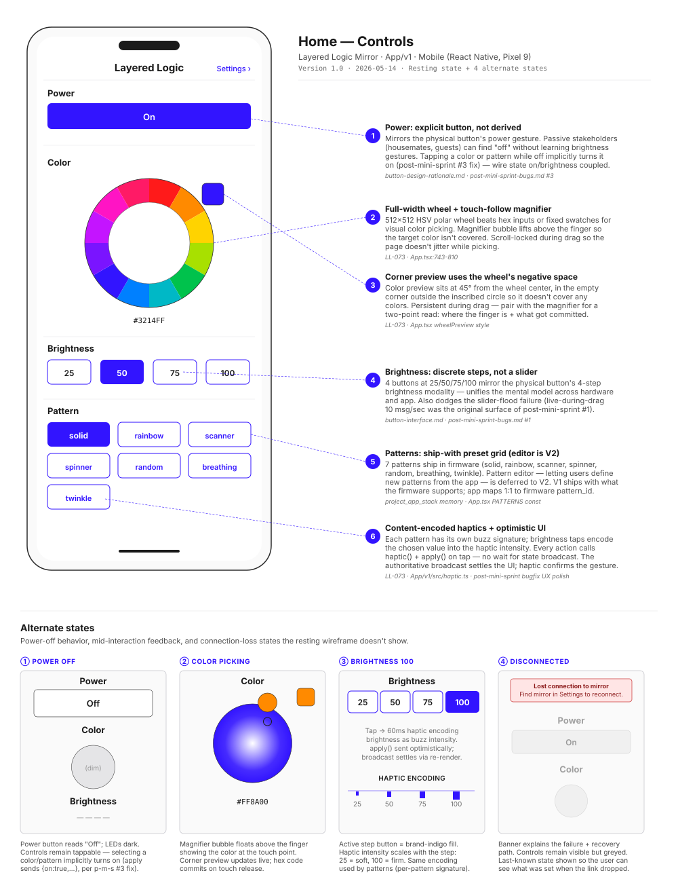

# Home — Controls

> **Chapter 2 of the LL-047 design-rationale set.** Home/Controls is the daily-use surface — what the user sees every time they open the app to change the mirror's appearance. Four control bands: Power, Color, Brightness, Pattern. Six first-order UX decisions, anchored to the physical-button modality and to bugs the mini-sprint surfaced.

**TL;DR:** Single-page scrollable control surface, no tabs. Power is an *explicit* button (not derived from brightness, despite the underlying wire-state coupling) — mirrors the physical button's power gesture and gives passive stakeholders a clear off. Color uses a full-width 512×512 HSV polar wheel with a touch-follow magnifier bubble lifting above the finger and a persistent corner preview. Brightness is *discrete steps* at 25/50/75/100, not a slider — matches the 4-step button modality and dodges the slider-flood bug from [post-mini-sprint #1](../post-mini-sprint-bugs.md). Patterns are a ship-with preset grid of 7 (solid / rainbow / scanner / spinner / random / breathing / twinkle); the pattern editor is V2 work. Every action fires content-encoded haptics on tap (intensity scales with brightness; each pattern has its own signature).

## Wireframe

## Where this lives in the user journey

This is the **default landing page** when the app reaches a connected mirror — Stage 7 (Daily Use) of the [service blueprint](../service-blueprint.md), inner branches *"set a mood"* and *"swap a pattern"*. Adjacent stages and surfaces:

- **Stage 6 — Unbox & Set Up** lands the user on the Setup screen (chapter 3); on first successful connect, app routes to this screen.
- **[Settings — Wi-Fi](settings-wifi.md) (chapter 1)** reached via the *Settings ›* link in the header. Round-trips back here on save.
- **Physical button on the device** is the redundant control path — every state set from this screen has a matching button gesture (see [button-interface.md](../button-interface.md)). The redundancy is the point: app for granular, button for ambient.

## Decisions

### ① Power: explicit button, not derived

Source: [button-design-rationale.md](../button-design-rationale.md) · [post-mini-sprint-bugs.md #3](../post-mini-sprint-bugs.md)

The wire state has both `on` and `brightness` as independent fields (`ll_state_t` in the firmware). A natural simplification would be to drop `on` and derive it from `brightness > 0`. We kept it as a separate field and surfaced an explicit Power button anyway, for two reasons:

1. **Physical button parity.** The hardware has a dedicated power gesture (long-hold to turn off, single-press to turn on at last-active brightness). The app mirroring that as its own button keeps the mental model consistent across surfaces.
2. **Passive stakeholders.** Housemates, guests, anyone who didn't configure the mirror needs to be able to turn it off without learning the brightness gesture. "Off" is the most common need from non-primary users.

The implicit-power-on coupling (tap a color while off → set color + on:true) was added in post-mini-sprint #3 to fix the dead-end where users tapped colors but nothing visible happened.

### ② Full-width color wheel + touch-follow magnifier

Source: [LL-073](../../tasks.md#LL-073) · App.tsx:743-810

512×512 HSV polar wheel beats hex inputs or a fixed swatch grid for two reasons: (a) visual color picking is faster than typing hex codes for non-developers, and (b) a continuous wheel covers the entire color space, not just curated brand swatches. Three details make it work:

- **Touch-follow magnifier bubble** lifts ~16px above the finger and shows the color *at the touch point*. Without it, the finger covers the target color and the user is picking blind.
- **Scroll-lock during drag** — the `onResponderTerminationRequest` returns false, denying ScrollView's request to take over the gesture. Without this, dragging on the wheel pans the page.
- **Live preview vs commit-on-release** — corner preview updates live during drag for visual feedback; the actual `apply()` (and the LED change) commits on release. Same backpressure-aware pattern as brightness.

### ③ Corner preview uses the wheel's negative space

Source: [LL-073](../../tasks.md#LL-073) · App.tsx wheelPreview style

The wheel is inscribed in a square; the top-right corner outside the inscribed circle is empty space. Placing the persistent color preview there means it never covers any color and never competes with the wheel for attention. At 45° from center, it's also the diagonally-furthest point from a typical right-handed user's thumb — invisible interference even during one-handed use.

Pairs with the magnifier (callout ②) for a two-point read: where the finger *is* (magnifier) and what got *committed* (corner preview). When they match, the user knows the gesture took.

### ④ Brightness: discrete steps, not a slider

Source: [button-interface.md](../button-interface.md) · [post-mini-sprint-bugs.md #1](../post-mini-sprint-bugs.md)

Four buttons at 25/50/75/100 — no slider, no 0. Two reasons:

1. **Mirror the physical-button modality.** The basic mode's brightness gesture has 4 stops (the same 25/50/75/100); putting a slider in the app would diverge from the button. Power button handles 0 (off).
2. **Dodge the slider-flood failure.** The webapp's first slider implementation was live-during-drag with a 100ms throttle — that 10 msg/sec rate hit the firmware's serialized broadcast fanout and triggered the "socket closed" bug ([#1](../post-mini-sprint-bugs.md)). Discrete buttons fire once per intentional action: no throttle needed, no backpressure surface.

Cost: less granular control. Acceptable because the use case is mood setting, not gradient grading; users wanting precision use the physical button which has the same 4 stops.

### ⑤ Pattern preset grid (editor is V2)

Source: [project_app_stack memory](../../.claude/projects/C--Users-bowhi-Desktop-Independent-Study/memory/project_app_stack.md) · App.tsx PATTERNS const

V1 ships with 7 fixed patterns baked into the firmware: `solid`, `rainbow`, `scanner`, `spinner`, `random`, `breathing`, `twinkle`. The app's pattern grid maps 1:1 to firmware `pattern_id` — no app-side pattern logic, just a chooser.

The pattern editor — letting users define new patterns from the app, with sliders for speed / hue range / step count etc. — is deferred to V2. Two reasons it's deferred: (a) the firmware's pattern interpreter is currently scaffold-only (per [project_firmware_status](../../.claude/projects/C--Users-bowhi-Desktop-Independent-Study/memory/project_firmware_status.md), `pattern_interp` is one of the 5 still-scaffold modules), and (b) the editor UX needs research to figure out the right abstraction (sliders for parameters? Direct manipulation? Code?). Shipping the editor before the research is more risky than shipping a curated preset set.

### ⑥ Content-encoded haptics + optimistic UI

Source: [LL-073](../../tasks.md#LL-073) · [App/v1/src/haptic.ts](../../App/v1/src/haptic.ts)

Every action button calls `haptic.X()` synchronously with `apply()` on tap. Two patterns:

- **Haptic content-encoding.** Each pattern has its own buzz signature (a unique pulse rhythm); brightness taps encode the chosen value into intensity (25 = soft, 100 = firm). The user feels *what* they tapped, not just *that* they tapped. Discoverable without looking at the screen — useful for ambient interaction (mirror across the room, dim ambient lighting).
- **Optimistic UI.** Apply sends the wire op immediately; the local state doesn't wait for the broadcast to update. The broadcast settles the UI via re-render (debounced — see [LL-055](../../tasks.md#LL-055)) so the user sees the apply land. If the network drops mid-tap, the UI shows the optimistic state until the disconnect banner appears (alt-state ④).

## Alternate states

| State | Trigger | Design response |
|---|---|---|
| **① Power off** | `state.on === false` | Power button reads "Off"; LEDs are dark. All other controls remain tappable. Selecting any color/pattern implicitly turns on (per post-mini-sprint #3 fix — `apply` sends `{on: true, ...}`). |
| **② Color picking** | Finger down on the wheel | Magnifier bubble appears ~16px above the touch point with the color at that pixel; corner preview updates live; hex code updates on commit. Page scroll is locked. |
| **③ Brightness 100 (or any step)** | User taps a brightness step | Active step takes brand-indigo fill; haptic plays at intensity matching the step (visualized as the four-bar swell in the alt panel). Same encoding pattern is reused for patterns (per-pattern signature). |
| **④ Disconnected** | WS link drops, reconnect-with-backoff failing | Red banner across the top explains failure + recovery (go to Settings → Find mirror). Controls remain visible but greyed; last-known state preserved so user can see what was set when the link dropped. |

## Considered & rejected

**Brightness as a continuous slider.** Rejected after the [post-mini-sprint #1](../post-mini-sprint-bugs.md) bug. The original webapp slider sent updates at 10 msg/sec during drag; firmware's serialized broadcast fanout couldn't keep up and the WS dropped intermittently. Discrete steps solve the throughput problem by definition: one inbound op per tap.

**Tabs separating Color / Brightness / Pattern into separate pages.** Rejected — splitting the four control bands across multiple pages would make composite adjustments (set indigo + 75% + breathing) a multi-tap journey through nav, vs. the current single-scroll page. The whole control surface fits in one viewport scroll on a Pixel-9-class phone.

**Free-text hex input for color.** Rejected — adds a keyboard surface, has validation pitfalls (wrong digit count, invalid chars), and the wheel covers the use case for >95% of users. Power users can still get the hex value via the displayed code below the wheel; setting a specific hex is a V2-tier "Pattern editor" feature when one exists.

**Implicit power-on coupling at the firmware level.** Rejected per the wire spec — `on` and `brightness` remain independent firmware fields. The implicit-power-on coupling is at the *app layer* (the apply payload sends both `{on: true, ...}` when the user taps something while off). Keeps the wire state clean and gives different clients (webapp, future Matter bridge) flexibility to handle the coupling differently.

## Research-to-design honesty

[LL-048](../../tasks.md#LL-048) end-buyer interviews still pending — same caveat as chapter 1.

| Decision | Status | Notes |
|---|---|---|
| ① Explicit Power | founder-intuition + button-parity | The parity argument is design-doc-grounded; the passive-stakeholder argument is intuition. Worth specifically asking interviewees who don't live alone. |
| ② Wheel + magnifier | hardware-validated | Bill iterated the wheel through LL-073 polish — magnifier added on the second hardware pass when finger-covers-target became obvious. |
| ③ Corner preview | hardware-validated | Same LL-073 polish round. The 45° / negative-space placement was Bill's call but tested in-hand before shipping. |
| ④ Discrete brightness | bug-validated | The slider-flood failure literally forced this decision. Mental-model unification with the physical button is a bonus, not the driver. |
| ⑤ Preset grid (no editor) | scope-driven | V1 scope decision tied to firmware scaffold status, not user preference. Editor UX needs research. **Worth asking interviewees whether the 7 presets cover their wants.** |
| ⑥ Content-encoded haptics | founder-intuition | Bill's call from LL-073 polish; not yet tested with users. The "ambient feedback without looking" claim is plausible but unvalidated. |

## Implementation gaps

- ✅ Power section — implemented
- ✅ Color wheel + magnifier + corner preview + hex display — implemented (LL-073)
- ✅ Brightness step buttons — implemented
- ✅ Pattern grid — implemented (7 patterns ship in firmware)
- ⚠️ **Per-pattern haptics** — implemented in haptic.ts but firmware-side pattern interpreter is still scaffold-only ([project_firmware_status memory](../../.claude/projects/C--Users-bowhi-Desktop-Independent-Study/memory/project_firmware_status.md)). The buzz fires; the LED behavior matches only for `solid`. Other 6 patterns are stubs.
- ❌ **Pattern editor** (V2 work) — not implemented; not in this chapter's scope but worth tracking as the natural extension.

## What shipped

- Firmware: [Firmware/v1/core/state_bus/](../../Firmware/v1/core/state_bus/) (state machine for on/brightness/color/pattern), [pattern_interp/](../../Firmware/v1/core/pattern_interp/) (scaffold, `solid` only).
- App: [App/v1/App.tsx](../../App/v1/App.tsx) Controls page (lines 743-836), [haptic.ts](../../App/v1/src/haptic.ts).
- Webapp: same control surface in [Firmware/v1/webapp/](../../Firmware/v1/webapp/) — feature-parity except brightness is still a slider there ([post-mini-sprint #1 fix](../post-mini-sprint-bugs.md) backed off to commit-on-release rather than going to step buttons).

## References

- [button-interface.md](../button-interface.md) — physical button modality this surface mirrors
- [button-design-rationale.md](../button-design-rationale.md) — why both app and buttons exist
- [Post Mini-Sprint Bugs #1, #3](../post-mini-sprint-bugs.md) — slider-flood and implicit-power-on bug-driven decisions
- [App.tsx Controls page](../../App/v1/App.tsx)
- [haptic.ts](../../App/v1/src/haptic.ts) — content-encoded haptic signatures
- [Service Blueprint Stage 7 — Daily Use](../service-blueprint.md) — journey context
- [Settings — Wi-Fi (chapter 1)](settings-wifi.md) — adjacent surface
