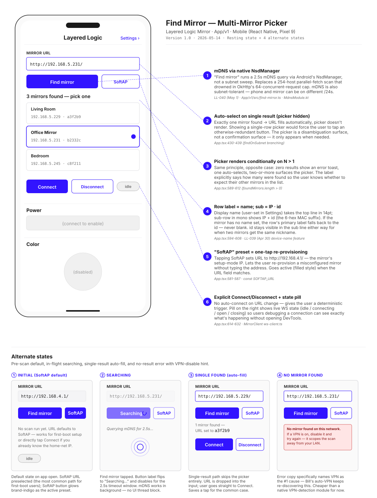

# Find Mirror — Multi-Mirror Picker

> **Chapter 4 of the LL-047 design-rationale set.** The connection panel is the layer between "I opened the app" and "I'm controlling a specific mirror." Conditional rendering does most of the design work here: zero results → error toast; one result → auto-fill, skip the picker; two or more → surface the picker. The technology underneath is native mDNS via Android's `NsdManager`, not the 254-host subnet sweep we tried first.

**TL;DR:** "Find mirror" runs a 2.5s mDNS query via a native Android module (`NsdManager`) — works across /24s and doesn't drown in OkHttp's 64-concurrent cap the way the original 254-host sweep did. Results branch on count: zero → error toast with VPN-disable hint (the #1 real-world failure cause); one → auto-fill the URL field, picker doesn't render; two-plus → multi-row picker with name + IP + id, brand-indigo border on the selected row. Connect/Disconnect stay explicit (no auto-connect on URL change) so users debugging the link see a clear state-machine they can step through. A "SoftAP" preset button is a one-tap reset to the setup-mode URL for re-provisioning.

## Wireframe

## Where this lives in the user journey

This surface sits at the **top of the Controls page**, above the actual control bands (Power / Color / Brightness / Pattern from [chapter 2](home-control.md)). When the WS isn't connected, the lower controls render disabled — the connection panel is what the user interacts with to get to the working state.

Two journey entry points:
- **First open after first-boot setup completes** — phone has rejoined home Wi-Fi; user opens the app; if a single mirror is on the network, "Find mirror" auto-fills and Connect is one tap. If multiple mirrors live in the house (post-purchase-multiple scenario from the [service blueprint Stage 7](../service-blueprint.md) custom-order branch), the picker disambiguates.
- **Reconnecting after the mirror moved networks** — Settings → Wi-Fi → switch active network on the mirror → mirror reboots on the new network → app loses connection → user comes back here and re-runs Find mirror.

Adjacent surfaces:
- **[First-boot Setup (chapter 3)](first-boot-setup.md)** — the upstream surface where the URL was initially the SoftAP. After provisioning, this panel is how the user finds the mirror on the home network.
- **[Home — Controls (chapter 2)](home-control.md)** — what renders below this panel once connected.
- **[Settings — Wi-Fi (chapter 1)](settings-wifi.md)** — surfaces a Connect button per non-active row that uses the same underlying `connect_wifi_network` op the picker hits from a different angle.

## Decisions

### ① mDNS via native NsdManager (replaces subnet sweep)

Source: [LL-040 (May 1)](../../tasks.md#LL-040) · [App/v1/src/find-mirror.ts](../../App/v1/src/find-mirror.ts) · [MdnsModule.kt](../../App/v1/android/app/src/main/java/com/v1/MdnsModule.kt)

The original "Find mirror" implementation fired 254 parallel `fetch`s probing each IP in the /24 with `GET /api/info`. OkHttp's dispatcher serialized them to 64 concurrent, the mirror's response landed past the abort timeout, and the scan returned empty.

Replaced with native mDNS via Android's `NsdManager`:
- 2.5s discovery timeout (per `DISCOVERY_TIMEOUT_MS`)
- 1.5s per-mirror probe timeout (per `PROBE_TIMEOUT_MS`)
- Subnet-tolerant: works when phone and mirror end up on different /24s of the same routed network — the subnet sweep couldn't.
- Doesn't compete with the app's other HTTP traffic for OkHttp's dispatcher slots.

Trade-off: requires the native module. Justified because (a) mDNS-on-RN libraries are unmaintained and have iOS-quirk issues, and (b) the native module is ~80 lines of Kotlin.

### ② Auto-select on single result (picker hidden)

Source: [App.tsx:430-439](../../App/v1/App.tsx) (`findOnSubnet` branching)

If exactly one mirror responds, the app drops the URL into the input directly and clears the picker. Rendering a single-row picker would mean the user has to tap a row to confirm something there's only one valid choice for — wastes a tap, and the row visually implies "this is one of several options" when it isn't.

The picker is a **disambiguation surface, not a confirmation surface.** Confirmation belongs to the Connect button.

### ③ Picker renders conditionally on N > 1

Source: [App.tsx:589-612](../../App/v1/App.tsx)

The same conditional pattern applied to the opposite case. Zero results → error toast (alt-state ④). One → auto-fill (alt-state ③). Two-plus → picker (resting state). The picker label explicitly says how many were found (*"3 mirrors found — pick one"*) so the user can sanity-check the result against the number of mirrors they actually have.

The count-aware label is small but does real work: if the user expects 3 mirrors and the picker says 2, they know to check the missing one's power before tapping anything.

### ④ Row label = name; sub = IP · id

Source: [App.tsx:594-608](../../App/v1/App.tsx) · [LL-039 (Apr 30)](../../tasks.md#LL-039)

Two-line layout per row:
- **Top:** display name (user-set in [Settings → Mirror name](settings-wifi.md)), 14pt bold
- **Bottom:** monospace, 12pt muted — `<IP> · <id>` where `id` is the 6-hex MAC suffix

Fallbacks:
- If the mirror has no name set (factory-fresh), the top line falls back to the `id`. Never blank.
- If the name IS set, the `id` stays visible in the sub line for the edge case where two mirrors get the same nickname (e.g., "Living Room" because the user has two and forgot which they named first). IP plus id always disambiguates.

The whole row is 56px tall, which is intentionally bigger than the 44px touch-target minimum — picking the wrong mirror is annoying enough that an oversized target is worth the vertical space.

### ⑤ "SoftAP" preset = one-tap re-provisioning

Source: [App.tsx:581-587](../../App/v1/App.tsx) · `const SOFTAP_URL`

A secondary button next to "Find mirror" sets the URL to `http://192.168.4.1/` — the mirror's setup-mode address. Two use cases it covers cheaply:

1. **Re-provisioning** — user wants to switch the mirror to a new home network. They join the mirror's SoftAP, tap SoftAP in the app, Connect, and route into the [First-boot Setup (chapter 3)](first-boot-setup.md) flow.
2. **SoftAP-only mode lookup** — user who skipped Wi-Fi setup and is controlling the mirror directly over SoftAP doesn't need the picker; they tap SoftAP to set the URL.

Goes active (filled brand-indigo) when the URL field matches — visual feedback that the preset is the current target.

### ⑥ Explicit Connect/Disconnect + live state pill

Source: [App.tsx:614-632](../../App/v1/App.tsx) · [ws-client.ts](../../App/v1/src/ws-client.ts)

No auto-connect on URL change. Three reasons:

1. **Deterministic trigger** — user knows exactly when the WS attempt starts. Auto-connect on every URL keystroke would spam reconnects.
2. **Picker tap is non-destructive** — choosing a row in the picker doesn't kick off a connection. User reviews the URL, then commits.
3. **Debuggability** — explicit Connect lets users (and Bill, during dev) step through the connection state machine without fighting auto-behavior.

The state pill on the right shows live WS state (`idle` / `connecting` / `open` / `closing`) — same vocabulary as the underlying `MirrorClient`. Users who don't read code still get a "something is happening" signal during the connecting state; users who do read code get the actual state name.

## Alternate states

| State | Trigger | Design response |
|---|---|---|
| **① Initial (SoftAP default)** | App open, no scan run yet | URL pre-fills with `http://192.168.4.1/`; SoftAP preset glows active; "idle" pill. Direct path for first-boot users who haven't provisioned yet. |
| **② Searching** | "Find mirror" tapped | Button label flips to "Searching…" + disabled; mDNS spinner animates 2.5s. Background work — no UI thread block. |
| **③ Single found (auto-fill)** | mDNS returns exactly one result | URL field populates with the discovered IP; picker doesn't render; Connect button is the next obvious action. Saves a tap for the common single-mirror household. |
| **④ No mirror found** | mDNS returns zero results | Red error toast with the actual error copy: *"No mirror found on this network. If a VPN is on, disable it and try again — it scopes the scan away from your LAN."* VPN hint is mentioned because it's literally the #1 cause Bill has hit repeatedly. |

## Considered & rejected

**Auto-connect on URL change.** Rejected per ⑥ — every URL keystroke would spam reconnects, and picker taps would tear down the current session before the user committed to switching.

**Subnet sweep (254-host parallel fetch).** Original implementation; rejected after LL-040 hardware testing showed it was unreliable. mDNS replaced it. The sweep code is still in git history if mDNS ever has to be ripped out, but no path back to the sweep is planned.

**Polling Find mirror automatically while idle.** Considered: re-scan every 30s if not connected, so the picker stays fresh. Rejected — burns battery on the user's phone for a tiny convenience gain, and mDNS noise on the network is unwelcome even at small rates. Manual Find mirror is the right cadence; the user is in the loop.

**Surfacing per-row signal strength (RSSI from /api/info).** Considered — `/api/info` carries enough info that we could probe each result for live signal. Rejected as out of scope for V1; the picker is for identity disambiguation, not network-quality triage. Add if real users actually pick the wrong mirror because of weak signal.

**A "scan again" button next to results.** Considered — let the user re-trigger Find without losing their picked selection. Rejected because tapping "Find mirror" again does this already (resets `foundMirrors`, runs a new scan, re-fills). One affordance, not two.

## Research-to-design honesty

[LL-048](../../tasks.md#LL-048) end-buyer interviews pending. Most decisions here are technical/architectural; the user-facing ones (label hierarchy in picker rows, error copy, button labeling) need usability validation.

| Decision | Status | Notes |
|---|---|---|
| ① mDNS via NsdManager | hardware-validated | LL-040 testing on Pixel 9 confirmed reliability across multiple Wi-Fi topologies. |
| ② Auto-select single | usability-aligned | Standard "don't make me confirm an only-choice" pattern. Low risk. |
| ③ Picker only when N > 1 | design-rationale-grounded | Same principle as ②. |
| ④ Name + id + IP row | founder-intuition | Hypothesis: name primary, id secondary, IP for debug. **Worth checking with users who have 2+ mirrors** — would they prefer room icons, last-controlled-time, or signal? |
| ⑤ SoftAP preset | founder-intuition | Bill's call from dev convenience. Real users who never re-provision may never tap this; might be worth burying. |
| ⑥ Explicit Connect/Disconnect | dev-grounded | Debug-friendly per Bill's testing. Whether end-users care about a pill that says "open" is open. |

## Implementation gaps

- ✅ mDNS via NsdManager — implemented (LL-040)
- ✅ Auto-select / picker / no-result branching — implemented
- ✅ SoftAP preset button — implemented
- ✅ Connect / Disconnect / state pill — implemented
- ⚠️ **No VPN-state detection** — error copy mentions VPN as a hint because RN core doesn't expose VPN status (NetInfo is connection-type only). A native module to read VPN state would let us pre-empt the error with proactive copy. Low priority.
- ⚠️ **iOS path missing** — `NsdManager` is Android-only. iOS would need a parallel `NetServiceBrowser` (Bonjour) implementation. V1 ships Android-only, so out of current scope.

## What shipped

- App: [App/v1/App.tsx](../../App/v1/App.tsx) (lines 561-633 — connection panel + picker + Connect/Disconnect)
- App: [App/v1/src/find-mirror.ts](../../App/v1/src/find-mirror.ts) (FindResult interface, 2.5s + 1.5s timeouts)
- Android: [App/v1/android/app/src/main/java/com/v1/MdnsModule.kt](../../App/v1/android/app/src/main/java/com/v1/MdnsModule.kt) (NsdManager bridge)
- Firmware: `GET /api/info` endpoint in [transport.c](../../Firmware/v1/core/transport/transport.c) (line 598+) — single-roundtrip identity probe

## References

- [LL-040 — RN release-build connectivity fixes](../../tasks.md#LL-040) — the task that ripped out the subnet sweep
- [LL-039 — Mirror name + multi-mirror discovery](../../tasks.md#LL-039) — the task that introduced display names + `/api/info`
- [App.tsx Connection panel](../../App/v1/App.tsx)
- [find-mirror.ts](../../App/v1/src/find-mirror.ts) · [MdnsModule.kt](../../App/v1/android/app/src/main/java/com/v1/MdnsModule.kt)
- [transport.c `/api/info`](../../Firmware/v1/core/transport/transport.c)
- [First-boot Setup (chapter 3)](first-boot-setup.md) — upstream surface
- [Home — Controls (chapter 2)](home-control.md) — downstream surface (renders below this panel)
- [Service Blueprint Stage 7](../service-blueprint.md) — journey context (multi-mirror is a custom-order-branch likely scenario)
