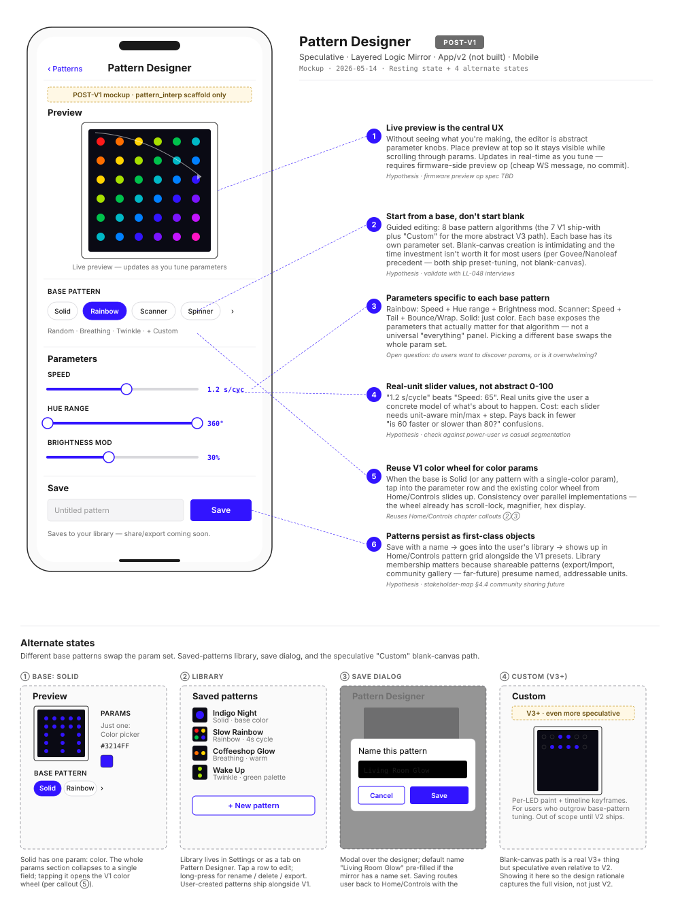

# Pattern Designer

> **Chapter 5 of the LL-047 design-rationale set — speculative V2 mockup.** V1 ships 7 fixed patterns baked into firmware (`solid`, `rainbow`, `scanner`, `spinner`, `random`, `breathing`, `twinkle`); [project_firmware_status memory](../../.claude/projects/C--Users-bowhi-Desktop-Independent-Study/memory/project_firmware_status.md) marks `pattern_interp` as one of the still-scaffold modules. This chapter explores what the natural V2 extension would look like and what user-research questions it would need to answer first.

**TL;DR:** A guided pattern editor — not a blank canvas. User picks a **base pattern algorithm** from chip-style selectors (the 7 V1 presets plus a "Custom" path), tunes its **algorithm-specific parameters** (Speed in seconds-per-cycle, Hue range in degrees, Brightness modulation %), watches a **live preview** of the 6×6 LED grid at the top of the screen, and saves to a **named library** that surfaces alongside the V1 presets on [Home/Controls](home-control.md). The wireframe carries POST-V1 badges throughout because it's documenting a path we'd take, not one we've taken — and the rationale doc weights "design hypothesis" over "locked decision" accordingly. Open question: do users actually want to *create* patterns, or are they fine with the curated 7?

## Wireframe

## Where this would live in the user journey

The Pattern Designer would extend **Stage 7 (Daily Use)** in the [service blueprint](../service-blueprint.md) — specifically the inner branch *"the V1 presets feel limiting, I want to make my own."* The trigger is a "+ New pattern" button on the [Home/Controls](home-control.md) pattern grid OR a dedicated tab in [Settings](settings-wifi.md).

Adjacent surfaces:
- **[Home/Controls (chapter 2)](home-control.md) Pattern grid** — entry point. Saved user patterns would render in the same grid as V1 presets, visually indistinguishable.
- **Settings → Patterns library** (new) — where saved patterns are managed (rename, delete, export, reorder).
- **[Settings — Wi-Fi (chapter 1)](settings-wifi.md)** — analogous surface in V1: same chip-row pattern for displaying named, persisted items.

The journey question for LL-048: *would your interviewee tap a "+ New pattern" button if it were there?* That answer is the trigger to actually build this.

## Design hypotheses

This chapter intentionally uses "hypothesis" instead of "decision" — V2 work means most calls are unvalidated.

### ① Live preview is the central UX

Putting the preview at the top so it stays visible while the user scrolls through parameter controls. Without seeing what you're making, the editor is abstract parameter knobs and the user can't form a tight feedback loop.

**Requires:** firmware-side preview op — a cheap WS message that streams a pattern config to the mirror without committing it as the active pattern. Currently undefined; spec TBD.

**Tradeoff:** if the user is across the room from the mirror, the live preview on the phone screen might compete with looking at the actual mirror. The 6×6 dot rendering is a proxy, not the real thing. Could test: how often does the user look up at the mirror vs. down at the preview during a design session?

### ② Start from a base, don't start blank

Guided editing: 8 base pattern algorithms (the 7 V1 ship-with patterns plus "Custom" for the more abstract V3 path). Each base has its own parameter set.

**Precedent:** Govee and Nanoleaf both ship preset-tuning, not blank-canvas. Blank canvas requires the user to know what they want before they start; preset-tuning lets them iterate from a working starting point.

**Open question:** which 8 bases? The 7 V1 patterns are the obvious set, but they were chosen for firmware-implementation simplicity, not for "covering the space of patterns users want." A V2 base set might add `gradient`, `chase`, `wave`, `meteor`, `fire` — common in the WLED preset library — at the cost of more firmware-side work.

### ③ Parameters specific to each base pattern

Each base exposes the parameters that actually matter for *that* algorithm — not a universal "everything" panel.

Per-base parameter sketches (TBD):
- **Solid** — color
- **Rainbow** — speed (s/cycle), hue range (°), brightness modulation (%)
- **Scanner** — speed (LEDs/sec), tail length (LEDs), bounce vs wrap, color source
- **Spinner** — period (s/rotation), direction (CW/CCW), tail length, color source
- **Random** — change interval (ms), saturation min/max, hue range
- **Breathing** — period (s), brightness range (min/max %), color
- **Twinkle** — density (% LEDs lit), fade time (ms), color palette

**Risk:** parameter discoverability. If switching from Rainbow → Scanner swaps the whole panel without animation or framing, users may get lost. A `<` "what changed" affordance might be needed.

### ④ Real-unit slider values, not abstract 0-100

"1.2 s/cycle" beats "Speed: 65". Real units give the user a concrete model of what's about to happen.

**Cost:** each slider needs unit-aware min/max/step. The Speed slider for Rainbow might be 0.2s–10s; for Scanner it's 0.5–20 LEDs/sec. Different bases, different scales.

**Pays back in:** fewer "is 60 faster or slower than 80?" confusions. Also makes patterns shareable as data — "Speed: 1.2s/cyc" travels across users in a way "Speed: 65" doesn't (65-of-what?).

**Open question:** for users who don't think in seconds-per-cycle, is "Slow / Medium / Fast" a better surface? Could do both: real-unit by default, descriptive labels in an accessibility setting.

### ⑤ Reuse V1 color wheel for color params

When a base has a single-color parameter (Solid, Breathing, etc.), tapping the color row opens the existing color wheel from [Home/Controls callout ②](home-control.md). No parallel color picker — the wheel already has scroll-lock, magnifier, hex display, all the polish from LL-073.

**Consistency wins:** users who learned the wheel in Controls don't relearn it here. Build-time wins: no parallel implementation.

### ⑥ Patterns persist as first-class named library items

Save with a name → goes into the user's library → shows up in the [Home/Controls](home-control.md) pattern grid alongside the V1 presets, visually indistinguishable.

**Implications:**
- Library membership matters because future shareable patterns (export/import as JSON, eventual community gallery per [stakeholder-map §4.4](../stakeholder-map.md)) presume named, addressable units.
- Saved patterns need to survive firmware OTA (NVS-persisted, schema-versioned).
- The 7 V1 presets stay in firmware; user patterns live in NVS. Boot path concatenates both into the displayed pattern list.

## Alternate states

| State | Trigger | Design response |
|---|---|---|
| **① Base: Solid** | User picks Solid from the chip row | Parameter panel collapses to a single field — Color. Tap opens the V1 color wheel. The whole editor reduces to "preview + color picker + save" — minimal surface for the minimal pattern. |
| **② Library** | User taps the Patterns tab / from Home Controls "+ New" affordance | List of saved patterns with miniature preview thumbnails, name, base + key parameter summary. Long-press for rename/delete/export. "+ New pattern" button at bottom. |
| **③ Save dialog** | User taps Save with a typed name | Modal over the designer with the name pre-filled (smart default: based on dominant color + mirror name, e.g., "Living Room Glow"). Cancel returns to designer; Save commits + routes back to Home/Controls with new pattern active. |
| **④ Custom (V3+)** | User picks "Custom" base | Even more speculative than V2 itself — per-LED paint with timeline keyframes. Shown to capture the full vision of what eventually serves power users, but explicitly out of V2 scope. |

## Considered & rejected

**Blank-canvas-as-default editor.** Rejected per ②. Too intimidating; users without a pattern in mind freeze. Preset-tuning is the right floor; blank-canvas is the ceiling (V3+).

**Generic 0–100 slider scale across all bases.** Rejected per ④. Strips meaning that "1.2 s/cycle" has.

**Live preview hidden behind a "Preview" button.** Rejected — the design feedback loop needs to be tight. Hiding the preview means users tune blind and check after, which doesn't iterate.

**Saving without a name** ("Untitled 1", "Untitled 2"…). Rejected — names are part of the library's value. The smart default ("Living Room Glow") covers the lazy case while still committing to a name.

**Direct manipulation (paint on a grid) as the V2 primary path.** Rejected for V2 — that's the V3+ Custom path. Direct manipulation on 32 LEDs is slow, and the math of mapping a still painting to a time-varying animation is its own design problem.

**Node-based / visual programming editor.** Rejected entirely. Powerful but the cognitive load is wildly out of scale with the use case (decorating ambient lighting, not building games). Power users who want this can already write firmware patterns — that path exists; we don't need to surface it.

## Research-to-design honesty

This chapter is the most aggressively unvalidated of the five — V2 work means most calls are guesses. [LL-048](../../tasks.md#LL-048) end-buyer interviews would land hardest here.

| Hypothesis | Status | Notes |
|---|---|---|
| Users want to create patterns at all | **unvalidated** | The whole chapter rests on this. Ask interviewees: do they tune Govee / Hue presets, or accept defaults? If "accept defaults" is dominant, Pattern Designer drops down the priority stack. |
| ① Live preview at top | founder-intuition | Standard editor pattern; safe yes if any editor ships. |
| ② Base + params (not blank) | precedent-grounded | Govee / Nanoleaf both do this. Risk is low. |
| ③ Per-base parameter sets | hypothesis | "Each base has its own panel" is intuitive but discoverability is a real concern. Worth observing a user switch bases mid-session. |
| ④ Real-unit sliders | hypothesis | Strong intuition but unvalidated. Should A/B against descriptive labels. |
| ⑤ Reuse color wheel | precedent-grounded | Already validated in V1. Pure consistency play. |
| ⑥ Named library | hypothesis | Whether users care about naming their patterns vs treating them as throwaway state isn't known. |

## Implementation gaps

This is a **fully speculative** chapter. None of this is built. The gap inventory:

- ❌ Firmware `pattern_interp` module — scaffold-only; only `solid` is implemented per project_firmware_status memory. Need to implement the other 6 base patterns properly first.
- ❌ Firmware-side **preview op** — a WS message that streams a pattern config without committing it. Spec TBD.
- ❌ Firmware-side **named pattern storage** — NVS schema for user patterns (id, name, base, params blob). Adjacent to the existing `ll_settings` namespace.
- ❌ App-side editor — the entire UI.
- ❌ Wire protocol additions — `add_pattern`, `update_pattern`, `delete_pattern`, `list_patterns`, `preview_pattern`. None defined.
- ❌ Export/import — JSON schema for shareable patterns. None defined.

**Realistic build path** if this becomes V2:
1. Firmware: finish `pattern_interp` for the 6 remaining V1 patterns. (~1 week)
2. Firmware: NVS schema for user patterns + load on boot. (~3 days)
3. Wire protocol: preview op + CRUD ops + state-broadcast additions. (~3 days)
4. App: Pattern Designer UI per this wireframe. (~1-2 weeks)
5. App: Library view + Home/Controls grid integration. (~3 days)

Total: 3-4 weeks of focused work, on top of validating the underlying question (do users want this?).

## What this depends on (cross-chapter)

- The [Home — Controls](home-control.md) pattern grid is the entry point. Saved patterns would render in that grid; the chapter 2 callout ⑤ explicitly noted the editor is "deferred to V2" — this is that V2.
- The [color wheel from Home/Controls](home-control.md) callouts ② and ③ is the color-picking surface this chapter would reuse.
- The firmware's `pattern_interp` scaffold (per [project_firmware_status memory](../../.claude/projects/C--Users-bowhi-Desktop-Independent-Study/memory/project_firmware_status.md)) is the prerequisite that has to complete first regardless of whether the editor ships.

## References

- [Home — Controls (chapter 2)](home-control.md) — pattern grid + callout ⑤ that flagged the editor as V2
- [project_firmware_status memory](../../.claude/projects/C--Users-bowhi-Desktop-Independent-Study/memory/project_firmware_status.md) — `pattern_interp` scaffold status
- [project_app_stack memory](../../.claude/projects/C--Users-bowhi-Desktop-Independent-Study/memory/project_app_stack.md) — "Pattern editor still V2"
- [stakeholder-map §4.4](../stakeholder-map.md) — community pattern sharing future
- [service-blueprint Stage 7](../service-blueprint.md) — Daily Use stage this would extend
- [LL-048](../../tasks.md#LL-048) — end-buyer interviews that would validate or kill this work
