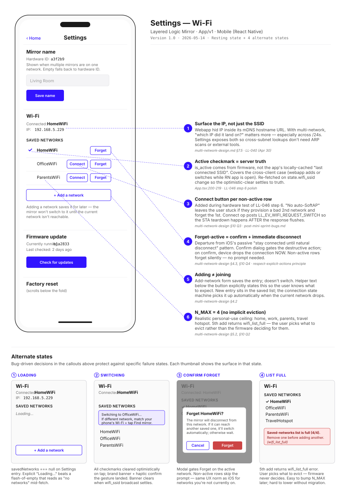

# Settings — Wi-Fi

> **Chapter 1 of the LL-047 design-rationale set.** The Settings → Wi-Fi surface is the densest decision history in the app — 6 first-order UX decisions, most of them surfaced by hitting real failure states on hardware, not on paper. This chapter pairs the lo-fi wireframe to those decisions and shows the 4 alternate states the resting wireframe doesn't.

**TL;DR:** Multi-network support shipped in May ([LL-046](../../tasks.md#LL-046)). The Settings surface ended up looking conventional but every visible affordance is the result of a deliberate choice — *active row* derives from server truth (covers cross-client edits), *Forget* on the active network gates behind a confirm dialog (departure from iOS passive pattern), *Add* doesn't switch (per design-doc §4.2), *Connect* exists per-row to recover from the stuck-on-bad-creds case the no-auto-SoftAP rule couldn't reach. The firmware-update section is curated to a single "Check for updates" button rather than a raw OTA URL — the current implementation still exposes the URL textarea (gap flagged below).

## Wireframe

## Where this lives in the user journey

This surface is reached from **Stage 7 — Daily Use** in the [service blueprint](../service-blueprint.md), specifically the *"my Wi-Fi changed / I'm moving the mirror to a new network"* branch. The user opens the app, lands on Controls by default, taps the Settings header link, and scrolls past Mirror Name to Wi-Fi. Adjacent stages:

- **Stage 6 — Unbox & Set Up** ([service-blueprint-flows.md](../service-blueprint-flows.md)) — first-network provisioning happens via a separate SoftAP captive flow, NOT this surface. This surface is the *second-network and beyond* path.
- **Stage 8 — Trouble & Repair** — if Wi-Fi creds are wrong or the mirror loses its network, recovery routes through this surface (Connect button on a known-good saved row) before falling back to recessed-button factory reset.

## Decisions

Each numbered callout on the wireframe corresponds to one design decision, indexed to its source rationale doc.

### ① Surface the IP, not just the SSID

Source: [multi-network-design.md §7.5](../multi-network-design.md) · LL-040 (Apr 30)

The webapp hides the mirror's IP inside its mDNS hostname URL. With multi-network, "which IP did the mirror end up on?" is information the user occasionally needs — e.g., when their phone and mirror end up on different /24s after a router quirk and `Find mirror` fails. Settings exposes both SSID and IP so cross-subnet recovery doesn't require ARP scans or an external tool.

### ② Active checkmark = server truth

Source: [App.tsx:200-219](../../App/v1/App.tsx) · LL-046 step 6 polish

`is_active` comes from the firmware's saved-networks list, not from the app's locally-cached "what SSID did I last see?" string. This covers the cross-client case: the webapp adds or switches networks while the RN app is open, and the RN app's checkmark needs to settle on the real active row without the user having to refresh manually. The list re-fetches on `state.wifi_ssid` change so the optimistic-clear (see alt-state ②) reconciles to truth.

### ③ Connect button per non-active row

Source: [multi-network-design.md §10 Q3](../multi-network-design.md) · [post-mini-sprint-bugs.md](../post-mini-sprint-bugs.md)

The spec deliberately excluded a "switch to this network" op (§4.2 Q1 — "adding ≠ joining"). Hardware testing of LL-046 step 6 surfaced a failure mode the no-auto-SoftAP rule doesn't recover from: provision a bad cred for a second network, forget the first network, and the mirror is stuck in `SCAN → fail → BACKOFF` with no way back short of USB recovery. Adding `connect_wifi_network` + a per-row Connect button closed the gap without violating the no-broadcast principle. The op posts `LL_EV_WIFI_REQUEST_SWITCH` so the STA teardown happens *after* the WS response flushes — otherwise the client sees a timeout while the switch actually succeeds.

### ④ Forget-active = confirm + immediate disconnect

Source: [multi-network-design.md §4.3, §10 Q4](../multi-network-design.md) · [feedback_respect_explicit_actions](../../.claude/projects/C--Users-bowhi-Desktop-Independent-Study/memory/feedback_respect_explicit_actions.md)

iOS keeps connected to a "forgotten" network until the natural disconnect (the user leaves WiFi range, reboots, etc.) — which reads as a bug to most users ("I told it to forget, why is it still connected?"). The mirror takes the opposite tack: if the user says forget, drop the connection now. The confirm dialog (alt-state ③) gates the destructive action so accidental taps don't strand the mirror. Non-active rows forget silently — there's no destructive consequence to disambiguate.

### ⑤ Adding ≠ joining

Source: [multi-network-design.md §4.2](../multi-network-design.md)

Add-network saves the entry to the firmware's NVS list. It does NOT trigger a switch. The new entry sits in the saved list with `last_used_us = 0`, and the connection state machine picks it up when the current network drops and a scan finds the new SSID. Helper text below the Add button states this explicitly so users with multi-network mental models from phones (where "add" usually means "join") aren't surprised when nothing visible happens.

### ⑥ N_MAX = 4 (no implicit eviction)

Source: [multi-network-design.md §5.2, §10 Q2](../multi-network-design.md)

Realistic personal-use ceiling: home, work, parents' house, one travel hotspot. Storing entries as separate NVS blobs (vs. one packed list) keeps add/remove from rewriting the whole list — friendlier to flash wear. The 5th add returns `wifi_list_full` (alt-state ④) — surfaces the cap to the user rather than picking eviction for them. Easy to bump N_MAX later; hard to lower without forcing an NVS migration.

## Alternate states

The resting state shown above is one of five canonical states. The other four document UX failure modes the design protects against.

| State | Trigger | Design response |
|---|---|---|
| **① Loading** | `savedNetworks === null` on Settings entry | Explicit "Loading…" placeholder beats a flash-of-empty that reads as "no networks". 1-2 frames visible at most. |
| **② Switching** | User taps Connect on a non-active row | Brand-indigo banner + 15ms haptic + optimistic-clear of all checkmarks. Banner clears when `wifi_ssid` broadcast settles (success or fallback). |
| **③ Confirm Forget** | User taps Forget on the active row | Modal scrim + warning copy explaining the disconnect. Cancel/Forget actions; non-active rows skip the prompt. |
| **④ List Full** | 5th `add_wifi_network` call | Inline error toast referencing the cap; user decides what to remove. Never silent-overwrite. |

## Considered & rejected

**Auto-SoftAP fallback when no saved network is visible.** Rejected per §10 Q3. Would have been the "convenient" default but violates the [RF-minimal-unless-asked](../../.claude/projects/C--Users-bowhi-Desktop-Independent-Study/memory/feedback_rf_minimal_unless_asked.md) principle. Recessed-button hold remains the explicit pairing trigger.

**Single-network model (status quo before LL-046).** Couldn't survive the "move the mirror to another room" / "travel hotspot" use cases without re-provisioning. The cost of the multi-network surface is ~424 B in NVS + small overhead — trivial vs. the user friction it removes.

**Implicit-eviction when adding a 5th network (newest replaces oldest).** Rejected per §10 Q2 — silent destructive operations violate the [respect-explicit-actions](../../.claude/projects/C--Users-bowhi-Desktop-Independent-Study/memory/feedback_respect_explicit_actions.md) principle even when the data loss is recoverable.

**Exposing the raw OTA URL in Firmware Update.** Currently shipped (see *Implementation gaps* below), rejected in this design. End-users shouldn't be typing URLs into their fridge mirror. The check-then-prompt flow shown is the target state.

## Research-to-design honesty

Marking which decisions are founder-intuition vs. research-validated. [LL-048](../../tasks.md#LL-048) end-buyer interviews are still pending — the campaign engaged May 14 but no replies have landed yet — so the validation column is currently all *founder-intuition*. Will update as research lands.

| Decision | Status | Notes |
|---|---|---|
| ① Surface IP | founder-intuition | Driven by Bill's own dev pain crossing /24s. Likely fine but worth a check with non-developer users. |
| ② Active checkmark = server truth | code-validated | Verified during cross-client testing on hardware May 7. Not a user-facing decision per se, but the UX rests on it. |
| ③ Connect button | hardware-validated | Bug-driven; the original spec rejected this op until LL-046 step 6 hardware test proved it necessary. |
| ④ Forget-active modal | founder-intuition | The "respect explicit actions" principle was Bill's call; users coming from iOS may find the immediate disconnect surprising. **Worth specifically testing.** |
| ⑤ Adding ≠ joining | founder-intuition | Mental model gap is the risk — users may expect "add" to mean "join". Helper text mitigates; usability test would tell us if it's enough. |
| ⑥ N_MAX = 4 | founder-intuition | Bill's personal-use ceiling. May be wrong for users with more contexts (Airbnb hosts, frequent travelers). Easy to bump on real signal. |

## Implementation gaps

What's in this wireframe vs. what's in [App/v1/App.tsx](../../App/v1/App.tsx) today:

- ✅ Mirror name section — implemented
- ✅ Wi-Fi connected display + saved-networks list — implemented
- ✅ Add-network inline form (not shown in resting state but reachable) — implemented
- ✅ Forget-active confirm dialog — implemented
- ✅ Connect button per non-active row — implemented
- ❌ **Firmware update section: still a raw OTA URL textarea + "Update firmware" button (dev-tool surface).** Wireframe shows the curated `Check for updates` button + version display. Gap tracked as a future LL-NNN under [LL-071](../../tasks.md#LL-071) (Production OTA infrastructure).

## What shipped

- Firmware: [Firmware/v1/core/ll_wifi/](../../Firmware/v1/core/ll_wifi/) (NVS layer + 27 host tests) + [Firmware/v1/core/provisioning/](../../Firmware/v1/core/provisioning/) (connection state machine)
- Wire protocol: `list_wifi_networks` / `add_wifi_network` / `remove_wifi_network` / `connect_wifi_network`
- App: [App/v1/App.tsx](../../App/v1/App.tsx) Settings page

## References

- [Multi-Network Design Doc](../multi-network-design.md) — design-doc canonical source for §-references above
- [Post Mini-Sprint Bug #1](../post-mini-sprint-bugs.md) — transient socket bug; tangential, but the LL-046 step 6 testing that surfaced ③ shares context
- [App.tsx Settings page implementation](../../App/v1/App.tsx)
- [Service Blueprint](../service-blueprint.md) — Stage 7 (Daily Use) is the journey context for this surface
- [Sprint Log Week 6](../../sprint_log.md) — full LL-046 implementation narrative
- [feedback_respect_explicit_actions](../../.claude/projects/C--Users-bowhi-Desktop-Independent-Study/memory/feedback_respect_explicit_actions.md) — the principle behind ④
- [feedback_rf_minimal_unless_asked](../../.claude/projects/C--Users-bowhi-Desktop-Independent-Study/memory/feedback_rf_minimal_unless_asked.md) — the principle that left the gap ③ fills
